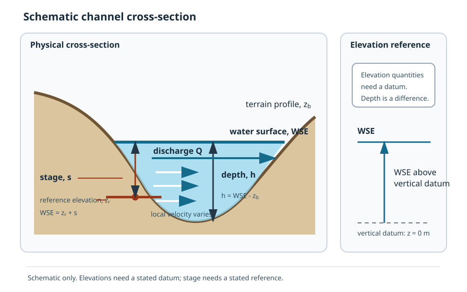

# Quantities, Units, and Datums

Hydraulic quantities become meaningful only when their units, location, time or scenario, coordinate reference, and vertical reference are known.
A single cross-section can show why WSE, stage, depth, velocity, discharge, storage, and slope describe different aspects of the same water state.

## Why this topic matters

Many geospatial failures produce plausible numbers.
A terrain raster and WSE raster can share a horizontal coordinate reference system while using incompatible vertical datums, units, or elevation conventions.
Subtracting them still produces a raster, but the resulting depth is not scientifically valid.

## Prerequisites

Read [What Is Flood Inundation Mapping?](01-what-is-fim.md).
Use [Glossary](../reference/glossary.md) and [Equations and Units](../reference/equations-and-units.md) as the stable definitions for this handbook.

## Learning objectives

After this chapter, the reader should be able to:

- distinguish terrain elevation, WSE, depth, and stage;
- state the units and reference needs of velocity, discharge, storage, and slope;
- explain the separate roles of horizontal CRS and vertical datum;
- calculate depth only after checking compatibility; and
- identify the minimum metadata needed before combining hydraulic and terrain artifacts.

## Read the cross-section first

**Figure VIS-001: Stage, depth, and datum at one cross-section.**
Notice that WSE and terrain elevation are both elevations measured from the vertical datum, while depth is their local difference.
Stage is measured from a stated reference elevation, which may differ from the datum origin.
The discharge arrow passes through the cross-section, while velocity varies within the wetted area and storage refers to water held over a spatial domain rather than at one line.
The figure is schematic and not to scale.

## Elevation, depth, and stage

### Terrain or bed elevation

Terrain elevation, $z_b$, is the elevation of the modeled ground or bed relative to a stated vertical datum.
Its SI unit is metres.
The word terrain does not guarantee that below-water channel bathymetry is represented accurately.

### Water-surface elevation

Water-surface elevation, $WSE$, is the elevation of the water surface relative to a stated vertical datum.
Its SI unit is metres.
WSE at two locations can be compared only after confirming compatible vertical references and units.

### Depth

Depth, $h$, is the local vertical distance between the water surface and terrain or bed.
For compatible inputs at the same horizontal location,

\[
h = WSE - z_b
\]

Depth is normally nonnegative in wet cells.
A negative calculated value may mean the location is dry, the surfaces are not colocated, the vertical references differ, the units differ, or one source contains an error.
The value should be interpreted rather than silently clipped before the cause is understood.

### Stage

Stage is water level relative to a stated reference.
The reference can be a vertical datum, a gauge zero, a local benchmark, or another defined elevation.
If a stage $s$ is measured from a reference elevation $z_r$, and both use the same vertical datum and units, then

\[
WSE = z_r + s
\]

A stage value without its reference is incomplete.
A stage of 3 m does not by itself mean a WSE of 3 m, a depth of 3 m, or 3 m above the local terrain.

## Worked compatibility example

Assume a terrain cell has $z_b = 101.4$ m and the colocated water surface has $WSE = 103.1$ m.
Both values use the same vertical datum and are elevations in metres.

\[
h = 103.1\ \text{m} - 101.4\ \text{m} = 1.7\ \text{m}
\]

The calculated depth is 1.7 m.
If the WSE instead used an unknown vertical reference, the subtraction would be numerically possible but scientifically unsupported.
The correct result would be an unresolved compatibility check, not 1.7 m.

## Flow and domain quantities

### Velocity

Velocity describes the rate and direction of water motion.
Horizontal velocity is commonly represented by components $u$ and $v$, each in m/s, or by a magnitude derived from those components.
Velocity can vary across the cross-section and over time even when total discharge is unchanged.

### Discharge

Discharge, $Q$, is the volume of water passing through a section or boundary per unit time.
Its SI unit is m3/s, and project inputs commonly use `cms` for the same unit.
For a cross-section,

\[
Q = A\bar{V}
\]

where $A$ is wetted area in m2 and $\bar{V}$ is section-averaged normal velocity in m/s.
Discharge is a flux through a boundary, not a volume stored in a domain.

### Storage

Storage, $V$, is the volume of water held within a defined area or control volume.
Its SI unit is m3.
Storage changes when inflow, outflow, or internal sources and sinks do not balance over an interval.
A small storage change does not by itself prove a complete mass balance because outflow and other terms must also be accounted for.

### Slope

Slope is a vertical change divided by a horizontal distance.
It is expressed as m/m and is dimensionless when both lengths use the same unit.
Terrain slope, water-surface slope, channel-bed slope, and energy slope are related concepts but are not automatically equal.
The intended slope must be named before it is used in a hydraulic boundary or equation.

## Quantity reference table

| Quantity | Symbol | SI unit | Required reference or support | Common mistake |
| --- | --- | --- | --- | --- |
| Terrain or bed elevation | $z_b$ | m | Horizontal location and vertical datum | Treating a terrain surface as complete channel bathymetry. |
| Water-surface elevation | $WSE$ | m | Horizontal location and vertical datum | Treating WSE as local depth. |
| Depth | $h$ | m | Colocated compatible WSE and terrain | Subtracting elevations with incompatible datums. |
| Stage | $s$ | m | Named zero or reference elevation | Reporting stage without its reference. |
| Velocity | $u$, $v$, $|V|$ | m/s | Direction, location, time, and averaging support | Treating one cell value as section-average velocity. |
| Discharge | $Q$ | m3/s | Section or boundary, direction, time or scenario | Treating discharge as stored volume. |
| Storage | $V$ | m3 | Defined domain or control volume and time | Calling storage change a complete mass balance. |
| Slope | $S_f$ | m/m | Named surface or energy reference and distance | Assuming all hydraulic slopes are interchangeable. |

## Horizontal CRS and vertical datum

A horizontal coordinate reference system, or horizontal CRS, locates features across the Earth's surface.
It defines coordinates, units, projection behavior, and a horizontal reference frame.

A vertical datum defines the reference surface from which elevations are measured.
Examples of vertical references include a geodetic vertical datum, an ellipsoidal height system, a tidal datum, a gauge zero, or a local project datum.

A horizontal CRS can be valid while the vertical information is missing, mislabeled, or incompatible.
An EPSG code on a raster may describe only the horizontal component.
It does not prove that two elevation rasters use the same vertical datum, height type, epoch, geoid model, or vertical unit.

### Compatibility example

Suppose a terrain raster and WSE raster both use the same projected horizontal CRS and align cell for cell.
The terrain elevations use orthometric heights from one vertical datum, while the WSE values use ellipsoidal heights or an undocumented local zero.
The horizontal alignment is valid, but the elevations do not yet share a proven reference.
Computing depth requires a documented vertical transformation or confirmation that the references are already compatible.

## Minimum checks before combining surfaces

Before calculating depth, transferring WSE, or compositing elevation products, record the following information:

1. Confirm that each artifact represents the intended quantity.
2. Confirm compatible horizontal location, grid alignment, resolution, and spatial extent, or document the resampling method.
3. Confirm compatible vertical datum, height type, epoch when relevant, and vertical unit.
4. Confirm that terrain and WSE refer to the same model realization and scenario context.
5. Confirm nodata, dry-cell, and wetting conventions.
6. Preserve the transformation and source provenance in the resulting artifact record.

If any required reference is unknown, label the result as an **Open question** rather than assuming compatibility.

## Project connections

**Current implementation:** `build_model` records an EPSG integer and creates terrain and roughness rasters on a common model grid.
The scenario manifest records the model inputs and final depth asset and has a nullable Zarr field intended for depth and WSE history.
Current public ND and KWSE jobs do not forward `save_zarr`, and the generic true branch cannot complete manifest construction with its directory store and file-only hashing.
These contracts support horizontal and provenance checks, but a horizontal EPSG code alone does not establish vertical compatibility.

**Current implementation:** The scenario properties record upstream discharge in whole cubic metres per second, the achieved upstream-end `nominal_wse` computed during post-processing, flooded area, maximum depth, median depth, simulated time, and convergence information.
The supplied KWSE `bc_value` is instead a nominal downstream-stage or stage-grid planning coordinate, and per-cell transferred `HFIX` values are separate imposed WSE boundary values.
Each property must retain its documented unit and meaning when used for planning or diagnosis.

**Open question:** A complete project-wide vertical-datum contract is not established merely by the fields inspected for this orientation chapter.
Later model-development and scientific-contract chapters must trace the source elevation metadata and transformations explicitly.

## Common misconceptions

### Matching cell grids prove matching elevations

Grid alignment proves only that cells occupy corresponding horizontal locations.
It does not prove compatible vertical references.

### Stage is always WSE

Stage equals WSE only when stage is explicitly referenced to the same datum origin used for WSE.
A local stage zero usually requires an offset before it becomes WSE.

### A unitless slope needs no metadata

Slope is dimensionless as a ratio, but its physical meaning still depends on which surface and distance were used.

### A small storage change proves steady flow

Storage can change slowly while inflow and outflow remain materially different or while local depth and extent are still changing.
The diagnostic criterion and intended use must be stated.

## Competency check

For each statement below, identify the missing information:

1. The WSE is 108.2 m.
2. The stage is 2.6 m.
3. Both rasters use EPSG:5070, so their elevation difference is depth.
4. Storage changed by less than 0.1 percent, so mass balance is closed.

A complete answer should name the missing vertical reference, stage zero, compatibility evidence, and full flux accounting where applicable.

## Source notes

- **Scientific foundation:** Stable definitions and equations are in [Glossary](../reference/glossary.md) and [Equations and Units](../reference/equations-and-units.md).
- **Current implementation:** Model and scenario fields are mapped under JOB-003 in [Bibliography and Source Map](../reference/bibliography.md).
- **Original visual:** Figure VIS-001 is registered in [Visual Source Register](../assets/source-register.md#vis-001-stage-depth-and-datum).
- **Open question:** Vertical compatibility must be proven from source metadata and transformations for each real artifact chain.
