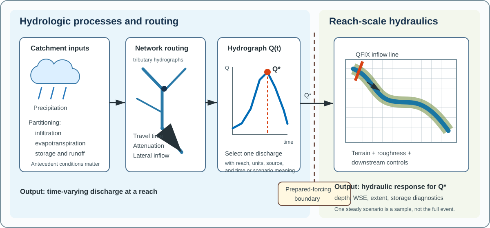

# Water Balance, Runoff, and Hydrographs

Rainfall or snowmelt does not become stream discharge all at once.
Water is partitioned among evapotranspiration, infiltration, storage, event runoff, and delayed contributions before the resulting flow appears as a hydrograph at a reach.

## Why this topic matters

A hydraulic model often begins after catchment partitioning and routing have been represented by prepared forcing.
The magnitude, timing, duration, and uncertainty of that forcing still control which hydraulic conditions a scenario can represent.

## Prerequisites

Read [Watersheds, Reaches, and Hydrofabrics](01-watersheds-reaches-and-hydrofabrics.md) and [Quantities, Units, and Datums](../00-orientation/03-quantities-units-and-datums.md).
Use the catchment outlet and reach identity established in the previous chapter when interpreting a hydrograph.

## Learning objectives

After this chapter, the reader should be able to:

- describe a catchment water balance without assuming all precipitation becomes runoff;
- explain how infiltration, evapotranspiration, storage, baseflow, and event runoff affect streamflow;
- identify the rising limb, peak, recession, duration, and volume of a discharge hydrograph;
- explain why antecedent conditions alter runoff response; and
- state the boundary between rainfall-runoff processes and a reach-scale hydraulic scenario.

## A bounded catchment water balance

**Scientific foundation:** A water balance accounts for water entering, leaving, and remaining within a defined catchment over a defined interval.
A useful catchment-scale form is

\[
\Delta S = V_P + V_{in} - V_{ET} - V_{out} - V_L
\]

- \(\Delta S\) is the change in water stored in soil, groundwater, surface depressions, lakes, snow, and other represented stores over the interval.
- \(V_P\) is precipitation volume over the catchment.
- \(V_{in}\) is water volume entering from outside the catchment through represented surface or subsurface pathways.
- \(V_{ET}\) is water volume returned to the atmosphere by evapotranspiration.
- \(V_{out}\) is water volume leaving through the catchment outlet.
- \(V_L\) represents another explicitly defined export or loss volume, such as a diversion that crosses the catchment boundary.

The terms must use compatible volumes, or every term must be converted consistently to equivalent depth over the same area and interval.
The equation is an accounting framework rather than a complete model of how quickly water moves between stores.
The [USGS watershed overview](https://www.usgs.gov/water-science-school/science/watersheds-and-drainage-basins) describes a watershed water budget and explains why not all precipitation leaves immediately as streamflow.

## How precipitation is partitioned

### Infiltration

**Scientific foundation:** Infiltration is water entering soil or rock from the land surface.
Some infiltrated water remains in soil, some moves deeper to groundwater, some returns to the atmosphere through evapotranspiration, and some later reaches a stream.
Infiltration depends on precipitation characteristics, soil and geologic properties, antecedent wetness, land cover, slope, and surface condition.

When rainfall intensity exceeds the surface's ability to accept water, or when the soil is already saturated, a larger portion can become rapid runoff.
This statement describes a mechanism rather than a universal runoff formula.

### Evapotranspiration

**Scientific foundation:** Evapotranspiration combines evaporation from water, soil, and wet surfaces with transpiration through plants.
It removes water from catchment stores and returns it to the atmosphere.
Over a short flood event, evapotranspiration may be smaller than precipitation and runoff terms, but its earlier effects on soil moisture can still influence the event response.

### Storage

**Scientific foundation:** Catchment storage includes water retained in soil, groundwater, snow, surface depressions, wetlands, lakes, and channels.
Storage delays water and can release it after precipitation ends.
Two storms with similar precipitation can therefore produce different hydrographs when antecedent storage differs.

### Event runoff and baseflow

**Scientific foundation:** Event runoff is the portion of streamflow response associated with a particular precipitation or melt event over a chosen analysis window.
It can include rapid surface and near-surface pathways and delayed contributions whose separation depends on the analysis method.

Baseflow is the relatively sustained component of streamflow supplied by delayed catchment storage, often including groundwater discharge.
Baseflow and event runoff are conceptual components of an observed hydrograph rather than two streams that can always be measured independently.
Hydrograph-separation results depend on the selected method and assumptions.

The [USGS infiltration overview](https://www.usgs.gov/water-science-school/science/infiltration-and-water-cycle) connects infiltration, groundwater storage, baseflow, soil properties, saturation, land cover, and runoff.
The [USGS surface-runoff overview](https://www.usgs.gov/water-science-school/science/surface-runoff-and-water-cycle) explains how reduced infiltration and faster drainage can increase runoff volume and flood peaks.

## From catchment response to a hydrograph

**Scientific foundation:** A discharge hydrograph plots discharge \(Q\) against time \(t\) at a stated location.
Its meaning requires the measurement or model location, time reference, units, data interval, and source.

The rising limb is the part of the hydrograph where discharge increases toward a local peak.
The peak discharge is the maximum discharge within the event window or other stated interval.
The recession limb is the part where discharge decreases as direct inputs weaken and catchment or channel storage drains.

Hydrograph duration is the time span assigned to the event or record segment.
Hydrograph volume is the time integral of discharge over the interval:

\[
V = \int_{t_0}^{t_1} Q(t)\,dt
\]

- \(V\) is flow volume in m3.
- \(Q(t)\) is discharge in m3/s.
- \(t\) is time in s.
- \(t_0\) and \(t_1\) define the integration interval.

For discrete observations, volume can be approximated by summing trapezoids between consecutive discharge values.
The interval must be fine enough for the intended use, and missing peaks or gaps can bias the estimate.

## What controls hydrograph shape

Material controls include:

- precipitation intensity, duration, timing, spatial pattern, and phase;
- catchment area, shape, slope, drainage density, and travel paths;
- soil, geology, land cover, imperviousness, and drainage modifications;
- antecedent soil moisture, groundwater level, snow or surface storage, and reservoir state;
- channel and floodplain storage, routing, diversions, and regulation; and
- the timing of tributary and local lateral inflows.

A steep rising limb and high peak can indicate rapid concentration of runoff, but the shape alone does not identify one unique cause.
A slow recession can reflect delayed release from soil, groundwater, lakes, wetlands, channels, or floodplains.
Interpretation requires catchment and event evidence.

## The hydrology-to-hydraulics boundary

**Figure VIS-002: From catchment response to a steady hydraulic scenario.**
Precipitation is partitioned and routed to form a time-varying hydrograph on the hydrology side.
One discharge is then selected with its reach, units, and time or scenario meaning before it crosses the boundary as prepared forcing.
The hydraulic model applies that discharge to a defined inflow geometry with terrain, roughness, and downstream controls.
The selected point preserves a magnitude but does not preserve the complete event hydrograph.

**Design principle:** Preserve the hydrologic source record when a hydrograph is reduced to one or more steady hydraulic scenarios.
The reduction should record why each discharge was selected and which event properties it no longer represents.

## Applied hydrograph example

**Applied example:** Assume a synthetic hydrograph for `R-200` is sampled every three hours.

| Time after start, h | Discharge, m3/s |
| ---: | ---: |
| 0 | 40 |
| 3 | 120 |
| 6 | 250 |
| 9 | 160 |
| 12 | 70 |

The rising limb spans the samples from 0 through 6 hours.
The sampled peak is 250 m3/s at 6 hours.
The recession spans the samples after 6 hours.

Using trapezoids and converting hours to seconds, the approximate volume is

\[
V \approx 3{,}600 \times 3 \times
\left[
\frac{40+120}{2} +
\frac{120+250}{2} +
\frac{250+160}{2} +
\frac{160+70}{2}
\right]
= 6{,}318{,}000\ \text{m3}
\]

A steady scenario of 250 m3/s samples a hydraulic response near the sampled peak magnitude.
It does not carry the 12-hour duration, the 6,318,000 m3 approximate event volume, the rising or falling history, or the possibility that the same discharge could occur under a different downstream state.

**Evidence note:** The computed volume follows from the five synthetic samples and trapezoidal interpolation only.
It does not establish an observed event volume or the adequacy of the sampling interval.

## Common misconceptions

### All precipitation becomes outlet discharge

Water can infiltrate, evaporate, transpire, remain in storage, cross another boundary, or reach the outlet after the selected event window.

### Baseflow means constant flow

Baseflow can vary over time.
The term identifies a relatively sustained contribution rather than a requirement that discharge remain constant.

### The hydrograph peak contains the event volume

Peak discharge is one magnitude.
Volume depends on discharge over the full integration interval.

### Hydraulic calculation time is event time

A calculation can evolve toward a stable hydraulic state under steady imposed discharge.
That elapsed model time does not reproduce the source catchment's precipitation and runoff timing.

## Competency check

Using the applied hydrograph, answer the following questions:

1. Which samples belong to the rising limb and recession?
2. What is the sampled peak discharge and its time?
3. Which assumptions enter the trapezoidal volume estimate?
4. What hydrologic information is missing if 250 m3/s is passed to a steady hydraulic scenario?
5. What provenance should accompany the selected value when it is associated with `R-200`?

## Source notes

- **Scientific foundation:** Catchment water balance is supported by [SCI-003](../reference/bibliography.md#sci-003-watersheds-and-drainage-basins).
- **Scientific foundation:** Infiltration, baseflow, and runoff response are supported by [SCI-005](../reference/bibliography.md#sci-005-infiltration-and-baseflow) and [SCI-006](../reference/bibliography.md#sci-006-surface-runoff-and-catchment-response).
- **Evidence note:** Figure VIS-002 is original handbook teaching material registered in the [Visual Source Register](../assets/source-register.md).
- **Evidence note:** The `R-200` hydrograph and volume calculation are synthetic and do not describe an observed or deployed event.
