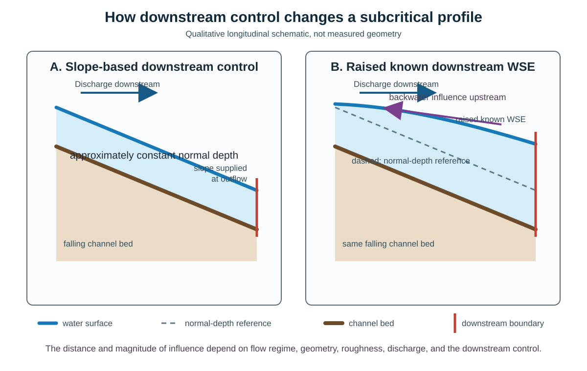

# Backwater and Boundary Control

Open-channel depth changes when the local flow cannot remain at one uniform depth.
A downstream stage, confluence, structure, lake, coast, or other control can alter the water surface upstream, especially during subcritical flow.

## Why this topic matters

Boundary conditions are part of the hydraulic problem, not administrative settings at the edge of a grid.
An unsuitable downstream condition can distort WSE, depth, velocity, storage, and inundation inside the area being interpreted.

## Prerequisites

Read [Energy, Momentum, and Flow Regimes](02-energy-momentum-and-flow-regimes.md) and [Manning Flow and Normal Depth](03-manning-flow-and-normal-depth.md).
Retain the distinction between geometric depth and WSE, and retain the stated downstream-positive sign convention.

## Learning objectives

After this chapter, the reader should be able to:

- define gradually varied flow, backwater, control section, and upstream or downstream influence;
- explain why a raised downstream WSE can affect an upstream subcritical profile;
- distinguish fixed-discharge, specified-stage, normal-depth outflow, closed-edge, transferred-stage, and initial conditions;
- keep software labels separate from physical boundary meanings; and
- identify evidence needed before choosing a boundary near a confluence, lake, coast, or structure.

## Gradually varied flow

**Scientific foundation:** Gradually varied flow is steady open-channel flow whose depth changes along the channel over a distance long enough that pressure remains approximately hydrostatic and one-dimensional profile reasoning remains useful.
Its depth is not constant, so it is not uniform flow.
It is also different from rapidly varied flow at a hydraulic jump, abrupt structure, or similarly short transition.

The simplified profile intuition used here assumes steady flow, one-dimensional and approximately hydrostatic treatment, gradual variation, prismatic geometry, and constant discharge or no material lateral inflow over the reach being interpreted.
It does not apply unchanged at a confluence, a material lateral inflow, an abrupt geometry transition, a hydraulic jump, a structure with rapidly varied flow, or a strongly two-dimensional flow pattern.
Those locations require a control-volume, network, structure, or numerical-model treatment that represents the added flow and momentum exchanges.

For subcritical flow, \(Fr<1\), a downstream disturbance can propagate information upstream under the idealized shallow-water interpretation.
If a downstream control raises depth above the local normal-depth tendency, the water surface can adjust over an upstream reach until the control's effect decays or meets another control.
That upstream increase in WSE is a backwater effect.

Backwater is not limited to dams.
A high downstream river stage at a confluence, a lake or reservoir level, a tidal water level, a bridge constriction, debris, or reduced conveyance can all create downstream control under suitable conditions.

## Control sections and influence directions

A control section is a location where geometry, a structure, critical flow, known stage, or another hydraulic relationship constrains the local stage-discharge state strongly enough to organize the neighboring profile.
Examples can include a weir crest, a free overfall near critical control, a constriction, or a downstream water body with observed stage.
The label must follow evidence for the actual mechanism.

Upstream influence means that a disturbance or imposed condition at a downstream location can alter hydraulics at locations upstream.
Downstream influence means that an upstream disturbance or imposed condition affects locations downstream.

In idealized subcritical flow, one shallow-water disturbance direction can travel upstream and one can travel downstream.
Both upstream and downstream hydraulic information can therefore matter.
In idealized supercritical flow, both characteristic directions travel downstream relative to the ground, so downstream conditions do not ordinarily determine the upstream solution.
Near critical, mixed, multidirectional, or rapidly varied conditions require more complete analysis than a single section-wide Froude number.

## Two downstream controls, one reach

**What to notice:** Both panels use the same falling bed and upstream discharge direction.
The left panel shows the uniform-flow reference implied by a slope-based normal-depth condition.
The right panel shows a raised downstream WSE, a deeper downstream section, and an influence arrow pointing upstream.
The dashed line in the right panel is the normal-depth reference, not a second simulated water surface.
The separation between the raised profile and the dashed reference grows toward the downstream control.
The drawing is qualitative and does not assert a distance of influence for a real reach.

The figure does not claim that known stage is always preferable.
It shows that the two boundary choices encode different hydraulic information and can produce different profiles.

## Boundary and initial conditions answer different questions

| Concept | What is prescribed | Typical hydraulic role | Main evidence need |
| --- | --- | --- | --- |
| Fixed-discharge boundary | Flow rate \(Q\), steady or time-varying. | Adds or removes a specified flux through a boundary. | Discharge magnitude or hydrograph, units, timing, geometry, direction, and provenance. |
| Specified-stage boundary | WSE relative to a stated vertical datum, steady or time-varying. | Constrains water level and allows flux response according to the solver and local state. | Datum-compatible stage evidence, time support, boundary location, and physical control. |
| Normal-depth outflow | Friction slope used with geometry and roughness to form a depth-discharge relation. | Allows outflow according to a uniform-flow approximation at the edge. | Defensible friction-slope estimate, roughness, geometry, flow regime, and distance from interpreted results. |
| Closed edge | Zero normal flux through the modeled edge. | Retains water inside that edge and can create pooling or reflection if placed across a real flow path. | Evidence that the edge is a divide, wall, symmetry boundary, or otherwise impermeable at modeled conditions. |
| Transferred-stage boundary | WSE information derived from another modeled scenario and mapped to a shared or intersecting geometry. | Carries downstream hydraulic control into an upstream model. | Compatible scenario identity, terrain, grid, datum, geometry, stage extraction, and provenance. |
| Initial condition | Water depth, WSE, or other state at simulation start. | Sets the starting state and can reduce or increase adjustment time. | Compatible state, datum, time, geometry, and justification for initialization. |

An initial condition does not remain a boundary constraint merely because the initial state touches an edge.
A stage can be used both to initialize and to constrain a boundary only when both roles are explicitly configured and supported.

The official HEC-RAS [2D external-boundary documentation](https://www.hec.usace.army.mil/confluence/rasdocs/r2dum/latest/boundary-and-initial-conditions-for-2d-flow-areas/external-boundary-conditions) distinguishes flow, stage, rating-curve, and normal-depth boundary types and separately describes optional stage-based initialization.
That documentation supports the conceptual distinctions for the cited HEC-RAS documentation and does not define another solver's behavior.

## Free outflow is not one universal condition

Terms such as free outflow, free boundary, open boundary, freefall, and normal depth are sometimes used loosely.
They are not interchangeable physical specifications.

A normal-depth boundary uses a friction slope, geometry, and roughness to form a stage-discharge relationship under a uniform-flow approximation.
A free overfall involves a physical control near critical flow and a drop in downstream support.
A steep slope supplied to a normal-depth boundary can lower the computed boundary depth and increase its ability to pass water, but it does not by naming alone reproduce all physics of a free overfall.
A closed edge imposes no normal flux and is the opposite of an unrestricted outlet.

Always record the actual mathematical or solver behavior, the geometry where it is applied, the numerical value and units, and the physical evidence that motivates it.

## Boundary placement and sensitivity

The [HEC-RAS downstream-boundary documentation](https://www.hec.usace.army.mil/confluence/rasdocs/ras1dtechref/6.0/theoretical-basis-for-one-dimensional-and-two-dimensional-hydrodynamic-calculations/1d-unsteady-flow-hydrodynamics/implicit-finite-difference-scheme/downstream-boundary-conditions) states that a normal-depth condition represents the stage that would occur under uniform flow and advises placing it far enough downstream that boundary error does not affect the study area.
The [steady-flow boundary guidance](https://www.hec.usace.army.mil/confluence/rasdocs/ras1dtechref/6.0/basic-data-requirements/steady-flow-data/boundary-conditions0) recommends varying the starting boundary elevation to test whether profiles converge before reaching the interpreted area.

A practical boundary-sensitivity review therefore asks:

1. Which physical quantity or relationship is being prescribed?
2. Is its location outside or inside the area where results will be interpreted?
3. Does the diagnosed flow regime permit upstream influence?
4. How far do plausible boundary alternatives change WSE, depth, velocity, storage, and inundation?
5. Do those changes decay before the decision-relevant area?
6. Is the apparent decay physical, or is it caused by domain limits, numerical diffusion, dry cells, or another modeled control?

Moving a boundary or changing its value is a sensitivity experiment.
It does not validate the preferred choice unless the choice also has physical evidence.

## Confluences, lakes, coasts, and structures require evidence

### Confluence

A tributary entering a higher-stage mainstem can experience backwater.
A local normal-depth outlet on the tributary can miss that downstream control.
The relevant evidence can include simultaneous flows, mainstem WSE, geometry, timing, and a compatible downstream scenario.
No universal rule says every confluence must use one boundary type.

### Lake or reservoir

A lake can impose a level-pool or time-varying stage, but outlet structures, wind setup, operations, bathymetry, and drawdown can complicate that picture.
A nearly zero normal-depth slope is not automatically equivalent to a known lake stage.
It can instead restrict outflow and cause model-dependent pooling.

### Coast or estuary

Tides, surge, waves, river flow, salinity effects, timing, and the selected vertical datum can matter.
A fixed stage can be unsuitable for a time-varying event, while a normal-depth outlet can omit coastal stage control entirely.
Coastal boundary selection requires event and datum evidence rather than a generic label.

### Structure

A bridge, culvert, weir, dam, gate, or other structure can create a stage-discharge control, energy loss, pressurized flow, overtopping, or rapidly varied transition.
Replacing the structure with a generic Manning slope or fixed stage can hide the controlling mechanism.
The required evidence depends on geometry, operations, submergence, blockage, and the flow range.

These contexts identify questions to investigate.
They are not universal prescriptions.

## Applied boundary example

**Applied example:** Reach R-100 uses a fixed-discharge boundary at its upstream edge and a normal-depth outflow at its downstream edge.
Reach R-200, immediately upstream of R-100, instead receives a transferred-stage boundary derived from R-100 at their shared interface.
The source depth raster is aligned with the source terrain and uses compatible linear units.
Depth has no vertical datum, so source WSE is derived by adding depth to terrain expressed in the terrain's vertical datum.
The derived WSE is then confirmed or transformed to the target vertical datum and aligned with the target grid, interface geometry, and time support.

The transfer procedure retains source wetness as an explicit condition.
A dry source cell is not converted into a specified-stage point merely because its terrain elevation is positive.
The procedure also retains separate intersection segments rather than filling dry gaps between them.

**Design principle:** Boundary records should state physical meaning, units, spatial support, time support, derivation, and provenance.
Software labels are insufficient when the same word could mean normal-depth outflow, physical freefall, a zero-depth outlet, or another solver-specific rule.

**Evidence note:** A transferred-stage boundary carries information from another modeled result.
It does not establish source alignment, unit compatibility, target-datum compatibility, wet-cell validity, hydraulic equivalence, or independence from the source scenario unless those properties are checked directly.

**Open question:** If an interface label says "open" but the configured value is a friction slope, should the boundary be interpreted as normal depth, freefall, or another documented solver relation?
Resolve the question from the governing equation and exact solver documentation, then revise the label so that it matches the behavior.

**Open question:** Lake, coastal, confluence, and structure boundaries remain site-specific choices.
No generic boundary type is justified without event timing, datum, geometry, forcing, sensitivity, and validation evidence.

## Common misconceptions

### Downstream control means water flows upstream

Backwater describes upstream influence on water level and related hydraulics.
The mean discharge can remain downstream while a shallow-water disturbance propagates upstream.

### A known downstream stage is always more accurate

It is more informative only when its location, time, datum, geometry, and physical control are compatible with the modeled event.
An incompatible stage can be a precise but wrong boundary.

### Closed edges are neutral

A closed edge enforces zero normal flux.
It can be appropriate at a real no-flow boundary and damaging across a real drainage path.

### An "open" label defines physical freefall

A label does not define the governing relation.
A normal-depth outflow remains a slope-based uniform-flow approximation even when an interface gives it a more general name.

### A hot start or wet initial grid supplies downstream control

An initial state affects the transient adjustment.
It does not replace a boundary condition that continues to act during the simulation.

## Competency check

For a subcritical reach, compare a slope-based downstream condition with a known downstream WSE that is 0.8 m above the calculated normal-depth WSE.
Predict the direction of downstream depth change and possible upstream influence.
Then list the geometry, datum, timing, roughness, slope, flow-regime, and sensitivity evidence needed before deciding which boundary better represents the physical system.

Finally, explain why the same answer cannot be applied automatically to a confluence, lake, coast, or structure.

## Practice

Complete [Lab 5: Backwater and Boundaries](../labs/lab-05-backwater-and-boundaries.md) to compare boundary choices across synthetic river, confluence, lake, coastal, and structure contexts while preserving evidence scopes.

## Source notes

- **Scientific foundation:** Boundary direction, normal-depth limitations, and boundary sensitivity are supported by [SCI-022](../reference/bibliography.md#sci-022-hec-ras-flow-regime-boundary-guidance), [SCI-024](../reference/bibliography.md#sci-024-hec-ras-downstream-boundary-conditions), and [SCI-026](../reference/bibliography.md#sci-026-hec-ras-2d-external-boundary-conditions).
- **Applied example:** The R-100 and R-200 boundary transfer is synthetic and demonstrates the evidence needed to realize a transferred-stage boundary.
- **Design principle:** Descriptive boundary terms should remain separate from solver-specific file labels and tokens.
