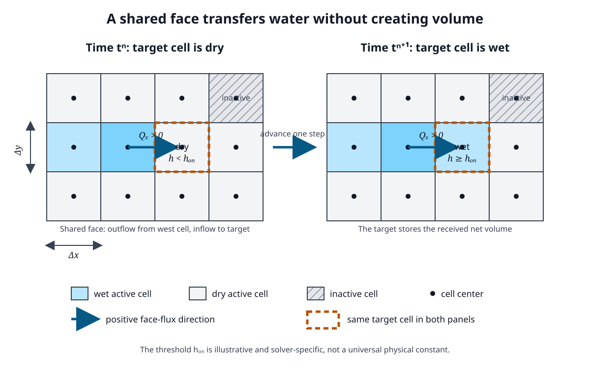

# Grids, Wetting, and Drying

A hydraulic grid turns a continuous landscape into cells, faces, state locations, and allowed flow connections.
Wetting and drying determine when those connections begin or stop carrying water.

## Why this topic matters

Grid geometry can preserve a channel, erase a notch, lower a ridge, disconnect a floodplain pocket, or create a pathway that does not exist in the source terrain.
Wetting-drying rules then decide how very shallow water advances through that representation.

## Prerequisites

Read [Shallow-Water Models](01-shallow-water-models.md) and retain the orientation definitions of CRS, vertical datum, terrain elevation, WSE, depth, and raster resolution.
The [Equations and Units](../reference/equations-and-units.md) reference defines the continuity and face-flux sign conventions used here.

## Learning objectives

After this chapter, the reader should be able to:

- identify structured cells, centers, faces, and neighboring flux connections;
- connect row-column indexing to an affine raster transform and map coordinates;
- explain active and inactive cells without confusing them with wet and dry cells;
- explain how terrain and roughness can be sampled or summarized for a hydraulic grid;
- describe a wetting front, dry threshold, thin-water treatment, and disconnected wet pocket; and
- explain how resolution and alignment can block or create a represented flow path.

## Grid anatomy

A structured rectilinear grid uses an ordered row-column arrangement.
Cell dimensions can be equal or different in the two horizontal directions, and a grid can be rotated relative to the map axes.
Each cell occupies an area rather than a mathematical point.

The cell center is a representative location for one or more stored state variables.
A cell face is the shared boundary segment between neighboring cells or a segment of the external domain boundary.
Flux across an internal face removes water from one neighbor and adds the same exchange to the other under a conservative sign convention.

Not every solver stores all variables at the same location.
A collocated arrangement can store depth and both velocity components at one cell location.
A staggered arrangement can store WSE or depth at cell centers and normal fluxes or velocity components at faces.
Both arrangements can implement conservation, and neither label alone establishes accuracy.

## Raster coordinates and the affine transform

A georeferenced raster needs more than an array of values.
Its affine transform maps pixel or cell coordinates to coordinates in the stated horizontal CRS:

\[
x=GT_0+cGT_1+rGT_2
\]

\[
y=GT_3+cGT_4+rGT_5
\]

- \(c\) is the column coordinate in pixel space.
- \(r\) is the row coordinate in pixel space.
- \(GT_0\) and \(GT_3\) locate the upper-left raster corner under the GDAL convention.
- \(GT_1\) and \(GT_5\) carry the principal pixel-size and orientation terms.
- \(GT_2\) and \(GT_4\) carry rotation or shear terms.

The upper-left cell center is evaluated at \(c=0.5\) and \(r=0.5\), not at the raster corner \(c=0,r=0\).
For a north-up raster, the rotation terms are normally zero and \(GT_5\) is normally negative.
The sign and orientation must be read from the transform rather than inferred from an array display.

The CRS defines horizontal coordinate meaning and units.
The affine transform defines origin, resolution, rotation, and pixel placement within that CRS.
The vertical datum and elevation units remain a separate contract.
Matching array dimensions without matching these spatial contracts does not establish alignment.

## Resolution and alignment are different decisions

Resolution describes the horizontal size or spacing of the represented cells.
Alignment describes where the cell boundaries and centers fall in the coordinate system.
Two 20 m rasters can have the same resolution but a 10 m origin offset, so their cell centers, boundaries, sampled elevations, and connected pathways differ.

Refining a grid can represent narrower terrain and water-surface changes, but it also increases the number of states and face exchanges.
Coarsening can reduce cost, but its effect depends on how terrain, roughness, barriers, channels, and subgrid properties are represented.
There is no solver-independent cell size that is correct for every reach or floodplain.

## Active, inactive, wet, and dry are separate states

An active cell belongs to the numerical domain and can participate in the configured hydraulic calculation.
An inactive cell is excluded from that calculation and normally cannot transmit flow through an ordinary internal face.
A boundary cell is an active or specially classified location where an external condition can enter the discrete problem, depending on the solver.

A wet cell contains enough represented water for the method to update its hydraulic state and fluxes as wet.
A dry cell is within the domain but does not meet the method's wet-state condition.
An active cell can therefore be dry now and wet later.
An inactive cell is not simply a dry cell waiting for water.

Domain masks should follow the intended hydraulic domain, boundary contracts, and terrain connectivity.
They should not be inferred from a reach centerline alone.

## A reach centerline is not the hydraulic domain

A reach centerline is a one-dimensional reference for network identity, direction, stationing, or geometry operations.
The hydraulic domain is the two-dimensional area within which cells and boundary conditions are defined.

The centerline can cross only a small part of the inundated floodplain.
It can also pass through a raster cell without proving that the cell contains a connected channel at the represented terrain resolution.
Domain construction must consider floodplain extent, terrain barriers, tributary and overland pathways, boundary placement, and the intended range of WSE.

## Sampling terrain and roughness

Terrain supplies elevation information that controls storage, depth, face openings, barriers, and pathways.
A simple raster-grid method can assign one representative terrain elevation to each cell and perhaps one elevation to each face.
A subgrid method can retain a relationship between WSE and cell storage or face conveyance using finer terrain samples.
The solver documentation must establish which representation is used.

Roughness can be uniform, cell-based, face-based, land-cover-derived, spatially averaged, or represented within subgrid tables.
Resampling a categorical land-cover class is not the same operation as averaging a continuous elevation surface.
A majority class can erase a narrow high-resistance strip, while a simple mean elevation can erase a narrow low swale or lower a narrow ridge.

Before combining terrain and roughness, check:

1. CRS and horizontal units.
2. Affine transform, origin, resolution, rotation, and extent.
3. Vertical units and datum for every elevation source.
4. Nodata and inactive-cell semantics.
5. Resampling or aggregation method and its physical meaning.
6. Whether the solver uses one value per cell, one value per face, or supported subgrid relationships.
7. Whether narrow controlling features remain in the represented hydraulic connections.

## Cell flux and a wetting transition

**What to notice:** The grid has cells, centers, and shared faces.
At time \(t^n\), the highlighted active cell is dry while its western neighbor is wet and sends a positive eastward face flux.
At time \(t^{n+1}\), the received volume has produced a thin positive depth above the illustrated wet-state threshold.
The equal and opposite face exchange conserves water between the two cells.
The diagram does not define a universal threshold or reproduce a specific solver stencil.

For a cell with horizontal area \(A_i\), a simple one-step volume account is

\[
\Delta h_i
=
\frac{\Delta t}{A_i}
\left(
\sum Q_{in}-\sum Q_{out}+Q_{source,i}
\right)
\]

This teaching relation assumes the area is represented as constant for the small depth change.
Methods with elevation-volume curves instead convert the new stored volume through the cell's storage relationship.

## Wetting and drying semantics

A wetting front is the moving boundary between represented wet and dry areas.
A dry active cell can become wet after net inflow raises its stored depth or WSE enough to satisfy the method's wetting logic.
A wet cell can become dry after net outflow, drainage, infiltration, or another represented sink lowers it below the drying logic.

Numerical methods commonly use small depth thresholds, flux limiters, regularized friction, or related controls near zero depth.
These controls are intended to limit negative depth, division by nearly zero depth, extreme friction terms, and transfer of more water than a cell stores.
Different wetting and drying thresholds can reduce repeated switching around one value.

No universal wetting or drying threshold is physically correct for all solvers and grids.
A documented solver default is solver-specific evidence, not a constant of shallow-water physics.
Changing a threshold can alter the represented timing, extent, thin connections, and runtime, so it requires sensitivity and validation evidence.

## Thin water and disconnected pockets

Thin water is a small positive represented depth near the wet-dry transition.
It can be physically meaningful sheet flow, residual storage, an initial layer, or a numerical device.
Its interpretation depends on terrain accuracy, vertical uncertainty, threshold logic, roughness treatment, and the result quantity being used.

A disconnected wet pocket is a wet group of cells with no currently open hydraulic connection to the main wet region under the represented grid and boundary state.
It can be a real depression filled by local source or prior flow.
It can also result from terrain noise, a blocked face, a domain mask, an over-broad minimum-elevation aggregation, or water left behind by numerical drying.
Connectivity must therefore be checked through face elevations and fluxes, not through color adjacency on a map alone.

Do not automatically delete a disconnected pocket or connect it to the nearest channel.
First determine whether the pocket is physically plausible, how it received water, and which representation controls its isolation.

## How coarse cells can block or create a pathway

Suppose a 30 m face contains three 10 m terrain samples with elevations 100.60, 100.05, and 100.60 m.
At WSE 100.30 m, the middle sample describes a 10 m notch that could pass water while the two higher samples remain barriers.

If one coarse face uses the mean elevation, its representative value is approximately 100.42 m and the notch is blocked at that WSE.
If one coarse face uses the minimum elevation, its representative value is 100.05 m and the entire 30 m face can appear open, creating too much conveyance.
A supported subgrid face relationship could retain part of the opening, but its behavior must be established from that solver's contract.

An origin shift can place the notch and ridge samples into different cells even when resolution is unchanged.
Resolution, alignment, aggregation, and face placement must therefore be reviewed together.

## Solver documentation examples do not define one universal grid

**Scientific foundation:** The cited HEC-RAS 6.6 documentation describes cell centers, faces, terrain-derived elevation-volume relationships, and face hydraulic-property tables.
The SFINCS 2.0.6 documentation describes a rectilinear grid, active-cell mask values, and optional subgrid tables.
These examples demonstrate that solvers can represent the same concepts differently.

**Evidence note:** The cited documentation establishes capability only for its stated solver and documentation scope.
It does not establish that a separate workflow implements, configures, or validates either grid representation.

## Common misconceptions

### Smaller cells always produce more correct results

Smaller cells can resolve more spatial detail, but they do not repair a datum error, missing bathymetry, unsuitable roughness, wrong boundary, or unsupported structure.
They can also expose terrain noise and require smaller time steps.

### A wet pixel next to another wet pixel proves hydraulic connectivity

Flux crosses faces according to represented face and state properties.
Map adjacency alone does not prove an open connection.

### Inactive and dry mean the same thing

Dry is a hydraulic state that can change.
Inactive is a domain classification that normally excludes the cell from ordinary updates.

### Raster resolution establishes alignment

Resolution does not establish origin, rotation, extent, CRS, or pixel placement.
The complete transform and CRS are required.

### A centerline defines channel cells

The centerline supplies a network or geometric reference.
Hydraulic connectivity depends on the domain, terrain, faces, structures, and boundary treatment.

## Competency check

For two rasters with the same dimensions and 20 m resolution, list every additional property needed before subtracting their values cell by cell.
Then explain how a dry active cell can become wet through one shared face without creating water.
Finally, use the three-sample notch example to explain how a mean elevation can block a path while a minimum elevation can create excess conveyance.

## Practice

Complete [Lab 6: Grid Stability and Wetting](../labs/lab-06-grid-stability-and-wetting.md) after reading [Time Stepping and Stability](03-time-stepping-and-stability.md).

## Source notes

- **Scientific foundation:** Grid cells, centers, faces, terrain representation, and cell-face hydraulic properties are supported by [SCI-028](../reference/bibliography.md#sci-028-hec-ras-2d-computational-mesh).
- **Scientific foundation:** Grid-size, terrain-feature, face-orientation, and rapidly varying WSE guidance is supported by [SCI-029](../reference/bibliography.md#sci-029-hec-ras-grid-size-and-time-step-guidance).
- **Scientific foundation:** The affine-transform equations and cell-center convention are supported by official GDAL documentation in [SCI-030](../reference/bibliography.md#sci-030-gdal-geotransform).
- **Scientific foundation:** Rectilinear-grid, active-mask, roughness, subgrid, and wet-state examples are supported for SFINCS documentation release 2.0.6 by [SCI-032](../reference/bibliography.md#sci-032-sfincs-user-manual).
