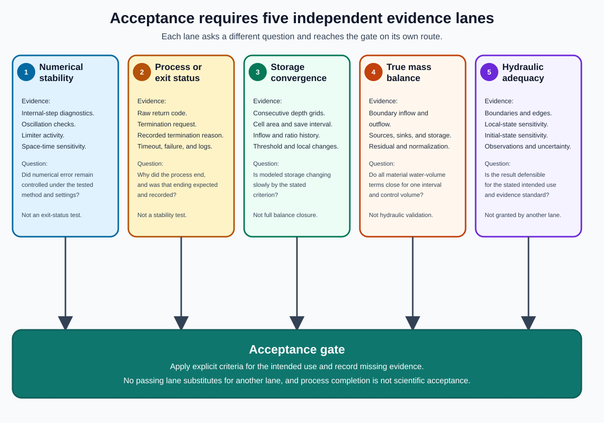

# Convergence, Mass Balance, and Hot Starts

A time-dependent hydraulic model can stop changing enough for one purpose without becoming exactly steady, closing its water balance, or representing the real reach adequately.
The evidence must therefore be separated before a scenario is accepted.

## Why this topic matters

An automated termination rule saves computation only when its diagnostic is interpreted within its real scope.
A hot start can shorten the adjustment period, but it can also carry an incompatible state into the target scenario.
Neither a small storage change nor a completed process replaces boundary, sensitivity, or observation evidence.

## Prerequisites

Read [Conservation, Discharge, and Storage](../02-open-channel-flow/01-conservation-discharge-and-storage.md), [Backwater and Boundary Control](../02-open-channel-flow/04-backwater-and-boundary-control.md), and all three preceding chapters in this section.
Retain the distinction among internal numerical time steps, saved-output intervals, boundary conditions, and initial conditions.

## Learning objectives

After this chapter, the reader should be able to:

- distinguish numerical stability, residual transient behavior, quasi-steady behavior, storage change, mass-balance closure, solver exit status, hydraulic adequacy, and acceptance;
- calculate and dimension a saved-output storage-change ratio;
- state exactly what the ratio measures and what it leaves unmeasured;
- identify complementary evidence needed before accepting a scenario;
- explain how a hot start changes only the initial-value problem; and
- identify which diagnostic records are needed without inferring evidence that was not stored.

## Evidence that answers different questions

| Evidence | Question answered | What it does not establish |
| --- | --- | --- |
| Numerical stability | Did numerical error remain controlled under the tested method, grid, state, and settings? | Quasi-steady behavior, mass balance, accuracy, or physical adequacy. |
| Residual transient behavior | Which relevant depths, WSEs, velocities, fluxes, or extents still change through time? | Whether the remaining change is acceptable without a criterion and use case. |
| Quasi-steady behavior | Are the stated quantities changing slowly enough over the stated interval and tolerance for the intended use? | Exact steady state, complete balance closure, or independence from the initial state. |
| Storage change | How much modeled water volume changed inside the domain between two times? | Why it changed or whether inflow, outflow, and sources close. |
| Inflow-outflow mass-balance closure | Does storage change agree with every material inflow, outflow, source, and sink over the same control volume and interval? | Hydraulic plausibility, numerical convergence under refinement, or agreement with observations. |
| Solver exit status | Did the process end normally, fail, reach a limit, or receive a termination request? | Stability, convergence, complete artifacts, or scientific acceptability. |
| Hydraulic adequacy | Do inputs, boundaries, states, outputs, sensitivities, and observations support the intended hydraulic use? | Formal approval unless the applicable acceptance criteria are also satisfied. |
| Acceptance | Has the authorized evidence set met the stated criteria for this use? | Suitability for a different use, reach class, solver, or uncertainty tolerance. |

The evidence categories can support one another, but none is a synonym for another.
For example, a smooth and stable calculation can keep filling slowly, a storage ratio can become small while inflow and outflow are both wrong, and a process can exit with code zero while its boundary condition is unsuitable.

## Residual transients and quasi-steady behavior

An unsteady solver advances a state through time even when the forcing is constant.
At first, water can fill channels and floodplain depressions, propagate to the downstream boundary, wet new cells, and adjust velocities and fluxes.
Later changes may become small without becoming zero.

Residual transient behavior is the change that remains in the quantities relevant to the decision.
The quantities must be named because domain-total storage can change little while one local WSE, wetting front, edge, or flow path still changes materially.

A quasi-steady claim therefore needs four parts:

1. Name the quantity or quantities being assessed.
2. Name the spatial support, such as the full domain, an interpretation area, a boundary, or selected locations.
3. Name the comparison interval and tolerance.
4. Explain why the resulting change is small enough for the intended product.

The word `converged` is incomplete without those parts.

## A saved-output storage-change ratio

For saved output times \(t-\Delta t_s\) and \(t\), consider the synthetic diagnostic

\[
C_V=
\frac{|V_t-V_{t-\Delta t_s}|}
{Q_{in}\Delta t_s}
\]

For square raster cells of width \(\Delta x\), the synthetic calculation estimates each stored volume as

\[
V_t=(\Delta x)^2\sum_{i\in P_t}h_{i,t}
\]

where \(P_t\) is the set of valid cells whose saved depth is positive at time \(t\).
Nodata cells do not contribute to the sum.

The numerator has units

\[
[|V_t-V_{t-\Delta t_s}|]=\text{m3}
\]

and the denominator has units

\[
[Q_{in}\Delta t_s]
=(\text{m3/s})(\text{s})
=\text{m3}
\]

so \(C_V\) is dimensionless.
The ratio is the magnitude of net modeled storage change between consecutive saved depth grids, normalized by the imposed inflow volume over that saved-output interval.

### Worked calculation

Suppose a square-grid scenario has \(\Delta x=20\ \text{m}\), \(Q_{in}=50\ \text{m3/s}\), and \(\Delta t_s=900\ \text{s}\).
Suppose the sums of positive cell depths are \(328.5000\ \text{m}\) and \(328.5900\ \text{m}\) at consecutive saved outputs.

The two stored volumes are

\[
V_0=(20\ \text{m})^2(328.5000\ \text{m})=131{,}400\ \text{m3}
\]

\[
V_1=(20\ \text{m})^2(328.5900\ \text{m})=131{,}436\ \text{m3}
\]

The absolute storage change is \(36\ \text{m3}\), and the interval inflow volume is

\[
Q_{in}\Delta t_s
=(50\ \text{m3/s})(900\ \text{s})
=45{,}000\ \text{m3}
\]

Therefore,

\[
C_V=\frac{36}{45{,}000}=0.0008
\]

This synthetic result is below \(10^{-3}\).
It establishes only the stated domain-storage comparison under the supplied values.

## Applied diagnostic semantics

**Applied example:** A synthetic run evaluates the ratio at each saved depth grid after the first.
The saved-output interval supplies \(\Delta t_s\), while the internal computational step and any separate diagnostic-output interval remain distinct quantities.
The run declares quasi-steady storage when \(C_V<10^{-3}\) for three consecutive saved intervals.
A ratio exactly equal to the tolerance does not satisfy that strict criterion.

The same run checks whether water reaches a domain edge that is not intended to carry flow.
Storage convergence and an unintended wet edge are recorded independently so that one result cannot suppress the other.
The run record also distinguishes solver completion, requested termination after meeting a criterion, wall-time limit, simulation-time limit, and process failure.

**Design principle:** Record each termination and diagnostic fact separately.
A single status should not collapse numerical convergence, edge behavior, process exit, artifact completeness, and hydraulic acceptance.

The synthetic result record stores the full ratio history, criterion and tolerance, saved-output times, termination request, process exit status, edge-check result, boundary-flux summary, and final artifact inventory.
It stores directory and file artifacts with type-appropriate integrity metadata rather than assuming that every artifact is one regular file.

**Evidence note:** A stored field establishes only the observation it actually records.
An omitted convergence history, edge result, outflow history, or balance residual cannot be inferred from a successful process exit or a final depth raster.

**Open question:** How many consecutive intervals and which local hydraulic quantities should supplement the storage threshold for the intended product?
The answer requires sensitivity and validation evidence across representative cases rather than one convenient run.

## What the ratio measures

The example ratio measures one domain-integrated response over one saved-output interval:

- It detects the magnitude of net storage change represented by the two positive-depth rasters.
- It normalizes that change by the constant imposed inflow volume during the interval.
- It can support a bounded claim that domain storage is changing slowly relative to supplied inflow.
- It provides an automated stopping signal under the selected threshold.

The absolute value treats filling and draining as equally unconverged at the same magnitude.
Because the diagnostic compares totals, positive and negative local depth changes can offset before the absolute value is applied to the net domain storage change.

## What the ratio does not measure

The ratio does not calculate boundary outflow.
It does not account explicitly for rainfall, infiltration, evaporation, exchange, or other modeled sources and sinks.
It does not show whether inflow equals outflow, whether local depths or velocities stopped changing, or whether the wet extent stabilized.
It does not show whether a wet edge is intended, whether the boundary influences the interpretation area, or whether the domain is large enough.
It does not establish numerical independence from grid size, internal time-step controls, saved-output interval, or convergence threshold.
It does not establish physical agreement with observed WSE, depth, extent, velocity, or timing.
It does not prove that the result is independent of the initial condition or hot-start source.

Calling this proxy "volume convergence" does not make it a complete water-volume or mass-balance closure test.

## Complete balance evidence

For the same control volume and interval, a closed volume balance would compare

\[
R_V=
\Delta S-
\left(
V_{in}-V_{out}+V_{source}-V_{sink}
\right)
\]

where every term has units m3 under one sign convention.
A useful report would state both the signed residual \(R_V\) and a declared normalization with guarded behavior when its scale is zero or very small.

The example termination calculation supplies \(\Delta S\) and the normalization \(V_{in}=Q_{in}\Delta t_s\).
It does not supply \(V_{out}\), all internal source and sink volumes, or \(R_V\).
No outflow-closure conclusion follows from a solver exit or scenario manifest.

## Complementary evidence for scenario review

A defensible review should consider evidence in separate lanes:

1. Inspect numerical stability diagnostics and any limiting cells or oscillations.
2. Plot storage ratio through time instead of relying only on its final value.
3. Inspect local WSE, depth, velocity, flux, and wet-extent change where those quantities matter.
4. Close the interval water balance from boundary and source or sink fluxes when the solver and workflow expose them.
5. Inspect the termination reason and distinguish controlled termination, solver completion, wall-time limit, simulation-time limit, and failure.
6. Inspect boundary and edge behavior, including whether water reached unintended edges.
7. Compare cold and compatible hot starts for the target scenario.
8. Perform spatial, temporal, parameter, boundary, and threshold sensitivities appropriate to the decision.
9. Compare relevant outputs with observations or an accepted benchmark.
10. Apply explicit acceptance criteria for the intended library or FIM use.

**What to notice:** Numerical stability, process or exit status, storage convergence, true mass-balance evidence, and hydraulic adequacy remain separate inputs to acceptance.
An acceptance gate can require all five without treating one as proof of another.

## Hot starts are initial conditions

A hot start initializes a target simulation from a prior modeled state rather than a dry or generic state.
If the source state is close to the target solution, the target run can spend less time filling storage and propagating an initial wetting front.
The tactic changes the initial condition, not the target forcing, boundary contract, or acceptance criteria.

The source and target must be compatible in grid geometry, alignment, CRS, vertical datum, terrain meaning, wet-depth meaning, and solver input convention.
They also need hydraulic compatibility in discharge, downstream condition, and expected flow paths.
A technically readable raster can still be a poor hydraulic initial state.

### Applied depth-only hot start

**Applied example:** A synthetic scenario sequence uses the prior scenario's final depth raster as the next scenario's initial water depth.
The initial-state record names the source scenario, discharge, downstream condition, grid, terrain, datum, and final depth artifact.
It does not claim to carry velocity, momentum, face flux, or a complete solver checkpoint.

The LISFLOOD-FP 5.9.6 manual defines an initial-depth input as a water-depth raster for that documented release.
That bounded manual claim does not establish how a different executable version initializes omitted motion variables.

**Evidence note:** The source scenario remains part of provenance because its forcing, boundary conditions, terrain, and final state affect the target's starting condition.
The source scenario's convergence or adequacy does not automatically transfer to the target scenario.

**Open question:** Does a target result agree when approached from a cold start and from more than one compatible depth-only hot start?
Without that comparison, initial-condition independence remains unestablished.

## Initial-condition sensitivity

At least one target-scenario comparison should use materially different defensible initial states when initial-condition dependence could affect the product.
Useful comparisons include a cold start and a compatible hot start, or two compatible hot starts approaching the target from different neighboring scenarios.

Compare the target result after applying the same forcing, boundaries, duration limits, and acceptance criteria.
Inspect final depth and WSE, wet extent, local flux or velocity where available, convergence history, termination reason, and balance evidence.
Material disagreement means the target has not shown independence from the tested initial-condition pathway.

A faster hot-started run is an efficiency result.
Agreement among adequately run initial-condition pathways is the evidence needed for an independence claim.

## Common misconceptions

### A small storage ratio proves steady flow

It proves only small net domain storage change relative to inflow over one saved interval.
Local changes, outflow error, and boundary effects can remain.

### A mass file name proves mass balance

An available file or configured write interval is not a reviewed balance calculation.
The relevant terms, units, interval, residual, and normalization must be inspected.

### A zero process exit proves convergence

An exit status reports process behavior.
The recorded termination reason and hydraulic evidence answer different questions.

### A hot start continues the previous simulation

The applied example reuses a final depth raster as a new initial condition under a target scenario.
It does not carry the complete prior dynamic state through a solver checkpoint.

### The shortest run is the best hot start

Short runtime can result from a nearby compatible state, an unsuitable state, premature termination, or missing work.
Runtime alone does not distinguish those explanations.

## Competency check

Explain why \(C_V=8\times10^{-4}\) can coexist with a poor inflow-outflow balance.
Name two local transient signals that can be hidden by a domain-total storage sum.
Then identify the exact state supplied by the applied depth-only hot start and state one comparison needed before claiming initial-condition independence.

## Practice

Complete [Lab 7: Convergence and Solver Evidence](../labs/lab-07-convergence-and-solver-evidence.md) after reading the solver comparison that follows.

## Source notes

- **Scientific foundation:** Storage continuity and the distinction between storage change and full balance are supported by [SCI-016](../reference/bibliography.md#sci-016-hec-ras-continuity-equation).
- **Applied example:** The storage criterion, independent edge result, termination record, and depth-only hot start are synthetic teaching contracts.
- **Scientific foundation:** The LISFLOOD-FP initial-depth statement is bounded to the official release 5.9.6 manual recorded in [SCI-033](../reference/bibliography.md#sci-033-lisflood-fp-user-manual).
- **Open question:** Storage-change and mass-balance evidence remain distinct, and depth-only initialization requires sensitivity testing before an independence claim.
