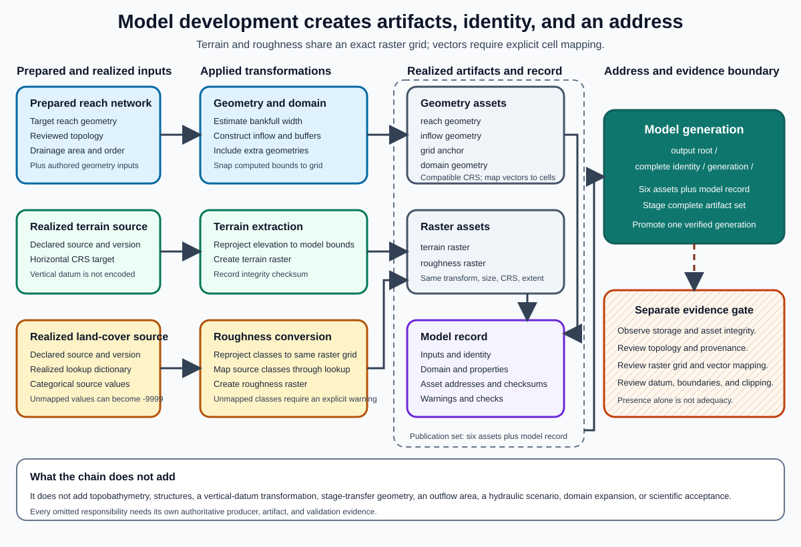

# The Model-Building Operation

A model-building operation transforms prepared network, terrain, roughness, geometry, and configuration inputs into a model record and named artifacts.
The operation should preserve the difference between requested inputs, realized settings, produced artifacts, warnings, identity, and observed storage state.

## Why this topic matters

A completed operation proves only that its implemented steps finished.
It does not by itself prove that inputs were authoritative, terrain and datums were compatible, the domain was adequate, or every expected artifact is present and valid.

## Prerequisites

Read [Network Preparation](01-network-preparation.md), [Terrain, Topobathymetry, and Structures](02-terrain-topobathymetry-and-structures.md), [Roughness and Land Cover](03-roughness-and-land-cover.md), and [Domain and Boundary Geometry](04-domain-and-boundary-geometry.md).

## Learning objectives

After this chapter, the reader should be able to:

- distinguish an input record from realized settings and a model record;
- trace a model-building operation from validation through publication;
- explain why defaults and source names are not complete provenance;
- identify output-affecting values that belong in model identity;
- distinguish exact reuse from unsafe same-address reuse;
- interpret warnings within the checks that produced them;
- distinguish a returned address from observed materialization; and
- define the evidence required before a built model supports scenarios.

## The operation boundary

The operation consumes one prepared reach and already authorized source records.
It does not decide how the network was prepared, which terrain source is scientifically preferred, which roughness values are calibrated, or whether the model is hydraulically accepted.

The operation is responsible for boundary validation, deterministic realization, artifact production, a complete model record, and a publication result.
Scientific acceptance remains a separate review.

## Input record

An input record describes the requested recipe before source resolution and geometry construction.
Common domain fields can include:

| Field | Purpose |
| --- | --- |
| `reach_id` | Select the prepared modeling unit. |
| `terrain_source` | Identify the requested elevation source. |
| `roughness_source` | Identify the requested land-cover or roughness source. |
| `grid_resolution` | Define intended hydraulic cell spacing. |
| `domain` | Provide an optional authored extent. |
| `artifacts` | Name required output roles. |

The complete input record should also carry the prepared-network version, horizontal and vertical references, source-content identities, roughness lookup, boundary-placement settings, structure settings, and any extra extent geometries.
These values can be represented without copying a private schema or internal implementation symbol.

## Realized settings

Realized settings record what the operation actually used after resolving defaults, source aliases, and derived geometry.
A fallback becomes evidence only after the operation records that it was selected.

**Design principle:** Never infer a realized source, reference system, or tolerance from a checked-in default.
Read the model record and the produced artifact metadata.

For the synthetic `R-200` model, the realized settings are:

| Setting | Realized value |
| --- | --- |
| Prepared network | Synthetic network version `N-1` |
| Terrain | Synthetic blended terrain content `T-200-A` |
| Roughness | Synthetic class conversion content `M-200-A` |
| Grid | 10 m square cells in a projected metre-based reference |
| Vertical reference | Example datum `VD-1`, metres |
| Domain | Computed and snapped to $(21020, 48100, 22640, 49620)$ m |
| Inflows | Separate lines for `R-100` and `R-300` |
| Downstream boundary region | Terminal edge segment for `R-200` |

The values are self-contained and belong only to the applied example.

## Model-building sequence

### 1. Validate the boundary record

Validate required fields, types, units, finite numeric values, allowed ranges, horizontal and vertical reference compatibility, and prepared-network membership.
Reject unknown fields when silent acceptance could hide a misspelling or obsolete setting.

Boundary validation establishes structural acceptability.
It does not establish hydraulic adequacy.

### 2. Resolve immutable sources

Resolve terrain, roughness, network, structure, and geometry references to immutable versions or content digests where exact reproduction matters.
Record both the human-readable source description and the immutable identity.

A source address can remain unchanged while its bytes change.
Hashing only the address does not pin the source.

### 3. Read the prepared reach and topology

Read the target reach, immediate upstream reaches, downstream reach, confluence classification, and lineage from the same prepared-network version.
Confirm that `R-100` and `R-300` are immediate upstream neighbours of `R-200` before constructing the two inflow geometries.

### 4. Realize roughness parameters

Load the class-to-roughness mapping, validate every realized class, and record the complete mapping.
Local overrides and calibration regions should have explicit priority and provenance.

### 5. Estimate or read characteristic width

A characteristic width can support buffers and inflow geometry, but the relation must state its inputs, units, calibration domain, and bounds.
For an illustrative power relation:

\[
W_{bf}=aA^b
\]

$A$ is drainage area and $a$ and $b$ are method parameters.
The applied model record should preserve the realized width rather than requiring later readers to reconstruct it from an undocumented relation.

### 6. Construct and inspect boundary geometry

Build inflow, outflow, and transfer-support geometry from the prepared topology and stated rules.
Check expected intersections, selected grid cells, orientation, width, and connectivity.

At the applied confluence, two inflow lines remain separate.
Combining them into one unnamed line would erase source-specific forcing and diagnostics.

### 7. Construct the domain and grid

Use either the authored domain or the documented computed-domain method.
Snap outward to the grid, calculate rows and columns, and preserve the realized transform, extent, anchor, and construction inputs.

### 8. Compute a complete identity

Model identity should change whenever an output-affecting scientific input changes.
At minimum, identity should cover:

- prepared-network version and reach lineage;
- target reach geometry;
- terrain and roughness content identities;
- horizontal and vertical references;
- grid resolution and exact realized transform;
- domain construction or authored extent;
- inflow and outflow geometry rules;
- structure and topobathymetry treatment; and
- producer and method versions needed for reproduction.

**Design principle:** A short hash can be a convenient label but should not be the only integrity evidence.
Store the canonical identity object and a full digest in the model record.

### 9. Check reuse safely

Reuse is safe only when the stored model record matches the complete requested identity and all required artifacts are observed with matching integrity metadata.
Folder presence, a matching short label, or a schema-valid record is insufficient.

If the address exists but the identity differs, create a distinct generation or stop with a clear collision error.
Do not overwrite a partially compatible model in place.

### 10. Produce terrain and roughness rasters

Clip or reproject terrain with the stated continuous-data method.
Reproject categorical land cover with a categorical method before applying the roughness lookup, or use an explicitly documented alternative.

Confirm that both outputs share the exact grid and that nodata, units, and references remain explicit.

### 11. Produce vector artifacts

Write artifacts by stable roles rather than relying on filenames to convey meaning.

| Artifact role | Required content |
| --- | --- |
| Centerline | Prepared target reach and lineage reference. |
| Inflow geometry | One or more named source boundaries with placement provenance. |
| Domain | Realized model extent and horizontal reference. |
| Grid anchor | Snapped reference used for addressing or comparison. |
| Boundary-support geometry | Outflow or transfer regions required by scenario setup. |

### 12. Build the model record

The model record should include:

- canonical input record;
- realized settings;
- complete identity object and digest;
- prepared-network and source provenance;
- domain and grid properties;
- artifact roles, addresses, sizes, and integrity values;
- warnings with structured evidence;
- producer version and creation time; and
- publication generation or transaction state.

The record should not use one field for two meanings or label a snapped anchor as an exact centroid.

### 13. Publish as one generation

Stage all artifacts and the model record under a new generation.
Verify the staged set, then promote the generation atomically when the storage system supports it.
When atomic promotion is unavailable, use a commit marker or equivalent protocol that prevents readers from adopting an incomplete set.

### 14. Observe storage

Read the promoted model record from its final address and verify every required artifact.
Observation should check identity, role, existence, size, integrity metadata, and required raster or vector compatibility.

The operation's returned address is a claim about intended output.
Independent observation establishes materialization.

## Model-development chain

The figure shows that prepared network, terrain, and roughness follow different transformations before they become one realized model.
The record and artifact set support traceability, while scientific acceptance remains a later gate.

## Warnings are bounded evidence

A useful warning carries a stable category, severity, location or affected cells, observed value, comparison threshold, and recommended check.
Warnings can cover:

- an inflow line with unexpected intersections;
- a domain that exceeds an operational size threshold;
- unmapped or invalid roughness values;
- missing or incompatible vertical-reference metadata;
- suspiciously uniform roughness;
- connected wet evidence near an unintended edge from a prior realization;
- a source that cannot be pinned immutably; and
- an existing address whose identity or artifacts do not match.

**Evidence note:** No warnings means only that the implemented checks found no reportable condition.
It does not prove correct topology, adequate domain extent, compatible datums, complete structures, or current artifact integrity.

## Synthetic failure examples

### Identity omits boundary placement

Two builds use the same reach, terrain, roughness, and grid but place an inflow on different tributaries.
If boundary placement is omitted from identity, unsafe reuse can return the wrong model.

### Publication stops after the rasters

Terrain and roughness reach the final address, but vector boundaries and the model record do not.
A reader that treats any folder content as completion can adopt a partial generation.

### Returned address is treated as observation

The operation returns a model address before a storage copy is visible or verified.
Downstream planning begins even though a required artifact is missing.

### Source identity covers only a mutable address

The terrain provider updates bytes behind the same address.
The next build appears to have the same identity even though the realized elevation changed.

## Scientific readiness after a successful build

A built model is ready for scenario work only when:

1. prepared topology and lineage have passed scientific acceptance;
2. terrain, roughness, structures, units, and datums are documented;
3. domain and boundary geometry pass spatial and hydraulic review;
4. model identity covers output-affecting inputs;
5. all required artifacts are observed and integrity checked;
6. warnings are resolved or dispositioned with rationale; and
7. sensitivity and validation plans match the intended use.

## Common misconceptions

### A validated input record is a validated model

Schema validation checks the request boundary.
It does not establish scientific adequacy.

### A source-address hash pins the source

It pins text, not mutable source bytes.

### Empty warnings mean the model passed quality control

Warnings cover only implemented checks.

### Exact record equality proves current artifacts

Artifacts can be missing, replaced, or partially published after the record was written.

### A returned directory proves materialization

Materialization requires observation at the final address.

## Competency check

1. What is the difference between the input record and realized settings?
2. Which output-affecting values belong in model identity?
3. Why is an address string insufficient source identity?
4. Which evidence is required before exact reuse is safe?
5. How does generation-based publication reduce partial-write risk?
6. What does an empty warning list establish?
7. Why must storage observation remain separate from the operation response?

## Further reading and source notes

- **Scientific foundation:** Terrain source and surface-treatment concepts are supported by [SCI-035](../reference/bibliography.md#sci-035-usgs-3dep-one-third-arc-second-dem) and [SCI-036](../reference/bibliography.md#sci-036-usgs-dem-surface-treatments).
- **Scientific foundation:** Land-cover and roughness concepts are supported by [SCI-039](../reference/bibliography.md#sci-039-annual-nlcd-collection-1-user-guide) and [SCI-040](../reference/bibliography.md#sci-040-usace-land-cover-and-mannings-n-guidance).
- **Scientific foundation:** Model credibility and evidence boundaries are supported by [SCI-043](../reference/bibliography.md#sci-043-nasa-standard-for-models-and-simulations), [SCI-044](../reference/bibliography.md#sci-044-nist-assessment-of-accuracy-and-reliability), and [SCI-045](../reference/bibliography.md#sci-045-epa-environmental-model-guidance).
