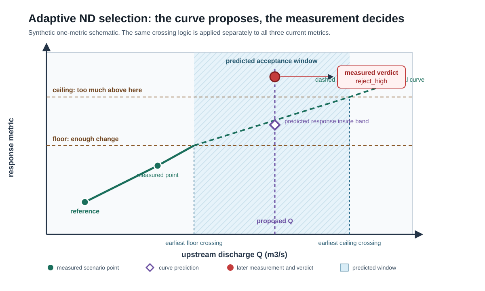

# Adaptive Discharge Selection

The current adaptive selector uses measured final-state depth and area metrics to place ND scenarios across a caller-supplied discharge range.
Response curves propose the next discharge, but the actual trial metrics determine its measured verdict.

## Why this topic matters

Equal discharge increments do not create equal hydraulic changes.
A small discharge increase can cross a levee, fill a side channel, or spread across a broad floodplain, while a much larger increase elsewhere can produce little map change.

Adaptive selection tries to spend simulations where the represented response changes and skip near-duplicate selected entries where it does not.
The algorithm also creates search overhead, depends on sequential depth-only warm starts, and can miss a sharp transition until a trial lands beyond it.

## Prerequisites

Read [Normal-Depth Libraries](01-normal-depth-libraries.md), [Grids, Wetting, and Drying](../03-2d-hydraulics/02-grids-wetting-and-drying.md), and [Convergence, Mass Balance, and Hot Starts](../03-2d-hydraulics/04-convergence-mass-balance-and-hot-starts.md).
Review the metric and window equations in [Equations and Units](../reference/equations-and-units.md#current-adaptive-nd-metrics-and-verdict).

## Learning objectives

After this chapter, the reader should be able to:

- distinguish `reference`, `position`, all finished scenario points, published trials, and selected members;
- calculate max-depth, median-depth, and flooded-area changes with the current units and zero-area rule;
- reproduce `reject_low`, `accept`, and `reject_high` verdicts;
- construct monotone response curves and calculate interpolated or extrapolated threshold crossings;
- derive the acceptance window and apply q-grid snapping and proposal fallbacks;
- explain endpoint, finest-step, maximum-discharge, and re-judgment behavior; and
- identify what current outputs do not preserve about selection and search history.

## Selected method and implemented method

**Selected methodology:** DR-030 ALT-C selects adaptive stepping based on hydraulic response.
Its stated goal is to avoid near-duplicate maps while increasing density around hydraulic transitions.

**Current implementation:** The current job uses maximum depth over wet cells, median depth over wet cells, and total flooded area from the final saved grid.
It does not sample maximum or median stage at fixed monitoring points as DR-030 describes.

DR-030 states example or selected bands of 0.75 to 1.25 m for maximum stage, 0.25 to 0.75 m for median stage, and 7.5 to 12.5 percent for extent.
Current code defaults are 0.75 to 1.25 m for maximum depth, 0.25 to 0.5 m for median depth, and 10 to 15 percent for flooded area.
These are different quantities and, for two criteria, different numeric bands.

This chapter teaches the exact current algorithm while preserving DR-030 as the selected-method source within its recorded scope.
The unresolved alignment is recorded in [CONF-015](../reference/conflicts-and-open-questions.md#conf-015-adaptive-nd-criteria-and-generated-documentation).

## State that the algorithm carries

### Reference

The `reference` is the current accepted selected scenario used as the denominator and baseline for the next measured comparison.
The minimum-discharge baseline begins as the reference.

When an ordinary trial is accepted, it becomes the new reference.
A finished scenario accepted during free-pass re-judgment can also become the new reference.

The maximum discharge is a forced selected endpoint, but the loop can stop without assigning it as the reference when its measured result is `accept` or `reject_low`.
Reference is therefore an algorithm state, not a complete membership list.

### Position

The `position` is the scenario whose final depth will hot-start the next newly simulated trial and whose discharge supplies the lower search position for one proposal fallback.
It advances on `accept` and `reject_low`.
It does not advance on an ordinary `reject_high`.

After a free re-judgment pass, the position can be the highest finished scenario classified `reject_low` against the current reference.
The position is not necessarily the trial that ran most recently and is not necessarily a selected member.

### Finished scenario points

The `done` mapping contains every scenario available to the invocation by discharge.
It combines adopted manifests and scenarios obtained during the current invocation.

Ordinarily rejected points remain in `done` because they improve proposal curves, can bound later windows, and can receive a different verdict when compared with a new reference.
The current implementation also publishes most newly simulated points before judging them.

### Published trials and selected members

A published trial has artifacts and a manifest at its scenario address.
A selected member is a discharge the adaptive control flow chooses to represent the library, including the baseline and maximum endpoint under ordinary completion.

Those sets are not equal in current code.
Every newly simulated non-edge-error trial is published before its measured verdict, including later `reject_low` and `reject_high` results.

The ND result does not contain an explicit membership list.
Free-pass acceptances are logged but not appended to the returned comparison list, a finest-step measured `reject_high` remains recorded as `reject_high` even when control flow treats it as accepted, and maximum inclusion is not marked by a dedicated field.

## The three current response metrics

The metrics use the final processed saved depth raster.
The wet set is every cell whose depth is strictly greater than zero.

For wet-cell depths $h_i$, square-cell resolution $r$, and wet-cell count $N_w$, current code reports:

\[
h_{max}=\max_{i\in W}(h_i)
\]

\[
h_{med}=\operatorname{median}_{i\in W}(h_i)
\]

\[
A_f=\frac{N_wr^2}{10^6}
\]

Maximum and median depth are in m when depth values are in m.
Flooded area is in km2 only when $r$ is in m.

The median's population changes as new shallow cells become wet.
Median depth can therefore fall even while discharge and flooded area rise.
That behavior is not necessarily a numerical error.

If no cell is wet, current code reports zero for all three metrics.
If the reference flooded area is zero, the current percentage-change expression returns 0.0 rather than dividing by zero.
The flooded-area change therefore cannot produce measured `accept` or `reject_high` for that comparison, even if the trial area is positive.
Proposal-window behavior is different because the relative floor and ceiling response targets both collapse to zero.
If a later flooded-area point is positive, crossing logic can return the reference or the lower endpoint of the first rising segment for both targets, so the area curve can create a degenerate or otherwise influential predicted window.
If the monotone flooded-area curve never rises above zero, it contributes no crossing.

## Default acceptance bands

| Criterion | Current measured change | Current default floor | Current default ceiling |
| --- | --- | ---: | ---: |
| Maximum depth | $h_{max,t}-h_{max,r}$ | 0.75 m | 1.25 m |
| Median depth | $h_{med,t}-h_{med,r}$ | 0.25 m | 0.50 m |
| Flooded area | $100(A_{f,t}-A_{f,r})/A_{f,r}$ | 10 percent | 15 percent |

The input model requires each maximum-depth and median-depth band to span at least 0.1 m and the area band to span at least 1 percentage point.
Those span checks do not establish scientific suitability for every reach or scale.

## The measured verdict

The current verdict gives ceiling violations priority.

1. Return `reject_high` if any metric change is strictly greater than its ceiling.
2. Otherwise return `accept` if any metric change is greater than or equal to its floor.
3. Otherwise return `reject_low` because all three changes are below their floors.

Equality to a ceiling is allowed because only a strict exceedance is high.
Equality to a floor is sufficient for acceptance.

Acceptance does not require all criteria to lie inside their individual bands.
It requires no criterion above its ceiling and at least one criterion at or above its floor.
A negative median-depth change can coexist with acceptance through maximum depth or flooded area.

The baseline has no reference.
Current code records zero changes and `accept` for it by construction.

## Curves are proposal aids, not verdicts

The selector builds one curve for each absolute metric using every finished scenario point sorted by discharge.
It does not build curves from only selected members.

Before interpolation, each metric sequence is replaced by its running maximum:

\[
\tilde y_i=\max(y_1,\ldots,y_i)
\]

This monotone envelope flattens decreases.
For median depth, a real fall caused by newly wetted shallow cells becomes a flat segment for proposal purposes even though the raw measured decrease remains in the verdict calculation.

Between simulated discharges, the crossing calculation uses a straight line segment.
Above the largest simulated discharge, it extends the slope of the final segment if that slope is positive.
It returns no crossing when fewer than two points define an extrapolation, when the target is not above the final value after segment checks, or when the final segment is flat or decreasing after monotone processing.

Interpolation or extrapolation never accepts a scenario.
It only selects where to measure next.

## Build the acceptance window

For each metric, the algorithm reads the monotone curve at the current reference discharge.
It adds the depth floor and ceiling in m.
For area, it multiplies the reference curve value by one plus the percentage floor or ceiling.

Each curve can therefore provide:

- a floor crossing where the change first becomes large enough; and
- a ceiling crossing where that criterion would first become too large.

The combined window opens at the earliest available floor crossing because any one criterion can satisfy a floor.
It closes at the earliest available ceiling crossing because every criterion must remain at or below its ceiling.

\[
Q_{open}=\min_j Q_{j,floor}
\]

\[
Q_{close}=\min_j Q_{j,ceiling}
\]

If no criterion has a floor crossing, the function returns no window.
If at least one floor exists but no ceiling exists, the close is positive infinity.
Both cases direct the proposal to the maximum discharge.

**What to notice:** The shaded discharge window comes from crossings on a monotone proposal curve.
The hollow diamond is the curve's predicted response at the proposed discharge.
The filled red point is the later measured response at that same discharge and lies above the ceiling, so the measured verdict is `reject_high` despite an in-window proposal.

## Apply the discharge grid and proposal fallbacks

For a finite window, the current selector searches a grid anchored to zero with spacing `q_grid_resolution` in whole m3/s.
The lowest eligible grid value is the greater of the first grid value at or above the opening and one grid step above the reference.
The highest eligible grid value is the last grid value at or below the closing.

When at least one grid value lies inside the window, the selector rounds the window midpoint to the grid and clamps it between the lowest and highest eligible values.
The implementation uses Python's `round` behavior before multiplying by the grid spacing.

When no grid value lies inside the window, the selector first aims at the largest grid value strictly below the opening.
If that value is at or below the position, it uses one grid step above the position instead.
The first fallback candidate is zero-grid aligned.
The replacement `position + q_grid_resolution` is not zero-grid aligned when the position came from an off-grid adopted scenario or off-grid opening trial.

The selector marks a proposal as `finest` when it equals `position + q_grid_resolution`.
If that finest trial measures `reject_high`, current control flow treats it as accepted because there is no intermediate grid value to try.
The returned comparison object still records the measured `reject_high` result.

If there is no window, the close is infinite, or the calculated proposal is at or above `max_upstream_inflow`, the selector returns the maximum exactly and marks it as an at-maximum proposal.
The maximum is not validated against the zero-anchored grid.

## Exact q-grid enforcement gaps

The input description says every scenario must land on the q-grid, but current code does not enforce that statement everywhere.

The following current values are not validated or snapped to `q_grid_resolution`:

- discharges in adopted `existing_scenarios` manifests;
- `min_upstream_inflow`;
- `max_upstream_inflow`; and
- the authored opening trial `min_upstream_inflow + delta_upstream_inflow`;
- a no-grid-value fallback that uses `position + q_grid_resolution` when `position` is off-grid; and
- any `_propose` path that returns the unsnapped maximum.

Finite-window midpoint proposals and the first below-window candidate are constructed on the zero-anchored grid.
Later `_propose` outputs are therefore not universally grid-snapped because the position-relative fallback and maximum-return paths preserve their off-grid source values.
If adopted scenarios make `done` contain more than one point at startup, the loop can skip the authored opening step and immediately derive a proposal from the adopted curves.

The code comment that says the orchestrator supplies a real per-reach grid cites DR-041.
No DR-041 row exists in the reviewed Decision Register, so the citation does not grant selected-methodology authority.

## Bootstrap from one point

One scenario point cannot define a segment or an extrapolation slope.
When `done` contains only the minimum baseline, the first trial is therefore:

\[
Q_{trial}=\min(Q_{min}+\Delta Q_{authored},Q_{max})
\]

This trial is not snapped to the q-grid.
If the authored step reaches or exceeds the maximum, current code runs the maximum as the opening trial.

After at least two points are in `done`, the curve-based proposal logic controls subsequent trials.

## Apply each verdict

### `reject_low`

All three measured changes are below their floors.
The trial remains published and in `done`, does not become the reference, and becomes the position and next hot-start source.

A long `reject_low` move is allowed.
The algorithm does not require every search increment to equal one grid step.

### `accept`

No measured change is above its ceiling, and at least one change reaches a floor.
The trial becomes both reference and position.

The algorithm then re-judges finished scenarios above the new reference before simulating another discharge.

### `reject_high`

At least one measured change is above its ceiling.
The trial remains published and in `done`, but ordinary control flow leaves both reference and position unchanged.

The new point can change interpolation and extrapolation enough to bring the next proposed window back toward the reference.
If the trial was marked `finest`, control flow overrides membership treatment to accept it while preserving the measured `reject_high` record.

## Re-judge finished runs after the reference advances

Re-judgment uses stored manifest metrics and does not rerun the solver.
The algorithm examines finished discharges above the reference from highest to lowest.

It skips `reject_high` candidates until it finds the first result that is not high.
If that result is `accept`, it promotes the scenario to reference, records a free advance internally, and repeats the scan against the new reference.
If that result is `reject_low`, it becomes the position and the free pass stops.
If every candidate is high, the position remains the reference.

A discharge can therefore be high relative to one reference, low relative to a later reference, or accepted relative to another.
The physical scenario did not change.
Only the comparison baseline changed.

Free-pass comparisons are emitted to logs but not appended to `scenario_comparison_results`.
The result therefore does not preserve a complete re-judgment history.

## Maximum-discharge behavior

The maximum is intended as a selected endpoint because later KWSE planning needs the top of the ND envelope.
When the maximum is newly simulated without edge error, current code publishes it before judgment as it does other trials.

If its measured verdict is `accept` or `reject_low`, the loop stops immediately.
The maximum is treated as a member, but the reference and position are not advanced through the ordinary verdict branches before the break.

If its measured verdict is `reject_high`, the maximum remains published and selected as the forced endpoint.
The loop continues to fill the gap below it.
The already finished maximum can later be re-judged after the reference advances.

Once the maximum has been processed and a later proposal again resolves to the maximum, the loop stops before another comparison.

A requested maximum not already in `done` can be newly simulated or exactly reused by full-input equality.
If either returned manifest has `edge_error`, it takes the adaptive abort before the maximum-membership branch.
A newly simulated edge-error maximum is not published, while an exactly reused edge-error maximum already remains in storage.
The run ends with partial prior results and a warning in either case.

## Worked proposal and verdict

Suppose the current reference is 100 m3/s with maximum depth 2.00 m, median depth 0.50 m, and flooded area 1.000 km2.
Suppose a finished trial at 150 m3/s has maximum depth 3.40 m, median depth 0.80 m, and flooded area 1.140 km2.

The measured changes are:

\[
\Delta h_{max}=3.40-2.00=1.40\ \text{m}
\]

\[
\Delta h_{med}=0.80-0.50=0.30\ \text{m}
\]

\[
\Delta A_f=100\frac{1.140-1.000}{1.000}=14.0\%
\]

Maximum depth exceeds its 1.25 m ceiling, so the verdict is `reject_high` even though median depth and area are within their default bands.

Now suppose a measured 140 m3/s trial gives 3.00 m, 0.78 m, and 1.120 km2.
Its changes from the 100 m3/s reference are 1.00 m, 0.28 m, and 12.0 percent.
No ceiling is exceeded and all three floors are reached, so the verdict is `accept`.

Re-judge the finished 150 m3/s point against the new 140 m3/s reference:

\[
\Delta h_{max}=3.40-3.00=0.40\ \text{m}
\]

\[
\Delta h_{med}=0.80-0.78=0.02\ \text{m}
\]

\[
\Delta A_f=100\frac{1.140-1.120}{1.120}\approx1.79\%
\]

All changes are below their floors, so 150 m3/s is now `reject_low` and becomes the position and next hot-start source.
It remains a published nonmember under the current monotone-in-discharge control flow because later proposals and accepted references move above this rejected-low position.
Later free-pass acceptance can apply to higher finished points that were previously skipped as `reject_high` against an earlier reference, not to this lower point after the reference has passed it.

[Lab 10](../labs/lab-10-follow-adaptive-nd-selection.md) continues this sequence through a curve-based next proposal, endpoint classification, and readiness judgment.

## Limitations and diagnostic consequences

### Sequential warm starts reduce parallelism and can introduce path dependence

The next target and its initial depth depend on prior measured results.
Ordinary trials therefore cannot be scheduled independently without changing the algorithm.

Depth-only initialization does not preserve full dynamic state.
Cold-start and alternate-start sensitivity remain necessary before claiming target-result independence.

### Floodplain transitions can be discovered late

Straight lines between sparse measured points cannot reveal an unsampled threshold.
A trial beyond a spillover or overtopping transition can measure `reject_high` and pull the next proposal back, but the first overshoot still costs a simulation and does not guarantee complete transition resolution.

Normal-depth downstream control can also suppress or distort transitions that depend on backwater or downstream stage.
Adaptive density under one boundary family is not proof of density under every plausible downstream condition.

### Flooded-area percentage is scale dependent

The flooded-area denominator is the reference's own area.
The same absolute new area produces a larger percentage near a small reference extent and a smaller percentage after the floodplain is already broad.

The two depth criteria use absolute metres rather than relative changes.
One set of bands therefore does not represent the same hydraulic distinction at all reach sizes, grid resolutions, or positions in the discharge range.

### The monotone envelope hides decreases for proposals

Running maxima prevent proposal curves from decreasing.
They can also erase information in a real median-depth decline or a noisy metric response.
The raw measured verdict still sees the decrease, so proposal and verdict evidence can tell different stories.

### Search overhead is stored

Rejected trials cost solver time, post-processing, and persistent storage under current publication semantics.
The result does not label them as overhead or return a selected-member index.

### Current outputs omit decision history

The response omits free-pass comparisons, the explicit selected set, the membership override for a finest `reject_high`, and a dedicated maximum-member marker.
The manifest records one scenario but not its later judgments against changing references.

Logs can contain some state and comparisons, but current artifact contracts do not promote a complete reproducible adaptive trace into a durable selection record.

## Readiness boundary

An ND selection is not ready for downstream scientific use merely because every returned comparison has a familiar verdict or every manifest exists.
Readiness requires, at minimum:

1. Traceable and authorized discharge bounds with $Q_{HFT}$, $Q_{100}$, source version, period, fit, uncertainty, and rounding defined.
2. An authorized metric and band contract that resolves the DR-030 and current-code mismatch.
3. A durable selected-membership record distinct from published search trials.
4. Storage observation for every required selected artifact.
5. A resolved q-grid authority and enforcement policy for adopted points, endpoints, and the opening trial.
6. Adequate convergence, mass-balance, edge, domain, hot-start sensitivity, and hydraulic validation evidence for the intended use.

Until those conditions are supported, the correct status is implementation evidence with open scientific and contract questions, not a validated production library.

## Common misconceptions

### The curve decides acceptance

The curve proposes a discharge.
Raw measured changes against the current reference determine the verdict.

### `accept` means every metric is inside its band

Acceptance requires no ceiling exceedance and at least one floor reached.
Other criteria can remain below their floors.

### `reject_low` means the simulation is invalid

It means the measured hydraulic change from the current reference was below all configured floors.
The result remains a usable search point and warm-start source under current control flow.

### `reject_high` is never selected

A measured high at the finest available step is treated as accepted by control flow, and the maximum is a forced endpoint unless a newly simulated or exactly reused maximum triggers the adaptive edge abort.

### The q-grid covers every scenario

Current code constructs finite-window midpoint proposals and the first below-window candidate on the zero-anchored grid.
Adopted points, endpoints, the opening authored step, an off-grid position-relative fallback, and a direct maximum return can remain off-grid.

### Published folders reveal the selected library

Current code publishes ordinary trials before verdict.
Folder presence therefore reveals simulations, not membership.

## Competency check

1. Why can reference and position name different scenarios?
2. What wet-cell population and units define each current metric?
3. Why does `reject_high` have priority over `accept`?
4. How do the earliest floor and earliest ceiling crossings define the combined window?
5. What happens when no criterion reaches a floor, no ceiling crossing exists, or no grid value lies inside the window?
6. Which endpoint, adoption, bootstrap, fallback, and maximum paths can bypass current q-grid alignment?
7. How can a finished scenario receive a different verdict without being rerun?
8. Which selected-membership decisions are absent or ambiguous in the current job result?

## Further reading and source notes

- [VIS-007](../assets/source-register.md#vis-007-adaptive-nd-proposal-and-measured-verdict) records provenance for the original diagram.
- [Decision-Code-Artifact Crosswalk XW-006](../reference/decision-code-artifact-crosswalk.md#xw-006-scenario-library-bounds-and-sampling) maps DR-029, DR-030, the absent DR-041 reference, code, inputs, artifacts, target design, and validation questions.
- [CONF-009](../reference/conflicts-and-open-questions.md#conf-009-scenario-publication-membership-reuse-and-discharge-grid-authority) records publication, adoption, membership, materialization, and q-grid gaps.
- [CONF-015](../reference/conflicts-and-open-questions.md#conf-015-adaptive-nd-criteria-and-generated-documentation) records metric, default-band, response, edge-abort, and generated-document conflicts.
- JOB-005 and JOB-007 in [Bibliography](../reference/bibliography.md) identify the exact current-code sources and reviewed revision.

No external source was required for this implementation-specific algorithm explanation.
