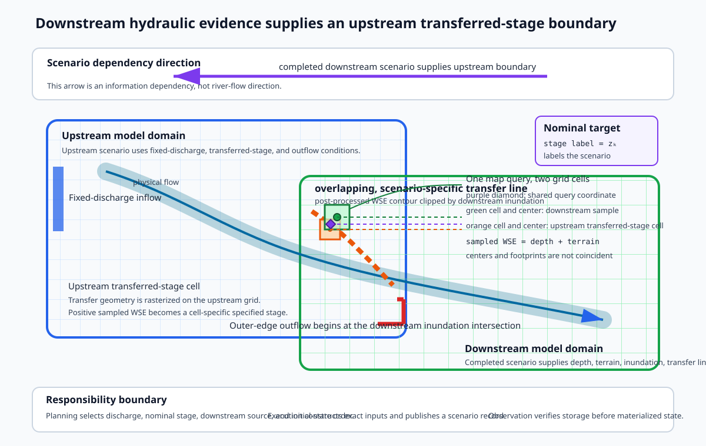

# Downstream-Stage-Aware Libraries and Stage Transfer

A downstream-stage-aware scenario couples an upstream reach model to a completed downstream scenario.
The upstream model applies its own discharge while receiving water-surface information along a transfer geometry derived from the downstream result.

## Why this topic matters

Backwater can make one upstream discharge produce different depths and extents under different downstream stages.
A useful library therefore preserves the source scenario, transfer geometry, grids, datums, boundary handling, initial state, identity, and artifacts.

A scalar stage can name a scenario, but the actual transferred boundary may contain many spatially varying values.
The distinction affects interpretation and reuse.

## Prerequisites

Read [Backwater and Boundary Control](../02-open-channel-flow/04-backwater-and-boundary-control.md), [Domain and Boundary Geometry](../04-model-development/04-domain-and-boundary-geometry.md), [Discharge-Only Scenario Libraries](01-normal-depth-libraries.md), and [Adaptive Discharge Selection](02-adaptive-discharge-selection.md).

## Learning objectives

After this chapter, the reader should be able to:

- explain the downstream-to-upstream direction of stage information;
- calculate transferred water-surface elevation from compatible depth and terrain;
- distinguish a nominal stage label from cell-specific transferred values;
- evaluate transfer geometry, raster coverage, nodata, and datum compatibility;
- define compatible depth-only hot starts;
- explain identity, address precision, reuse, and publication risks; and
- specify evidence required for a stage-aware library.

## Scientific transfer relationship

At a compatible source cell $i$:

\[
\eta_{ds,i}=h_{ds,i}+z_{ds,i}
\]

$\eta_{ds,i}$ is downstream water-surface elevation, $h_{ds,i}$ is downstream depth, and $z_{ds,i}$ is downstream terrain elevation.
The calculation requires matching grid support, units, nodata treatment, and vertical reference.

Applying the value upstream additionally requires compatibility between the downstream water surface and upstream terrain datum.
A line crossing on a map is necessary but not sufficient.

Backwater and boundary-control concepts are supported by [SCI-024](../reference/bibliography.md#sci-024-hec-ras-downstream-boundary-conditions) and [SCI-026](../reference/bibliography.md#sci-026-hec-ras-2d-external-boundary-conditions).

## Synthetic stage-aware family

**Applied example:** `R-100` and `R-300` are immediately upstream of `R-200`.
Stage information moves from completed `R-200` scenarios upstream to both tributary models.

The `R-100` discharge set contains 60, 100, and 140 cubic metres per second.
The `R-300` discharge set contains 40, 60, and 80 cubic metres per second.
Both upstream reaches use nominal downstream stages of 102.0, 102.5, and 103.0 m in vertical datum `VD-1`.

The downstream `R-200` source scenarios are:

| `R-200` discharge | Transfer-support stage at the confluence |
| ---: | ---: |
| 100 m3/s | 101.8 m |
| 125 m3/s | 102.0 m |
| 175 m3/s | 102.4 m |
| 200 m3/s | 102.7 m |
| 225 m3/s | 102.9 m |
| 250 m3/s | 103.2 m |

Nominal stage 102.0 m binds directly to the 125 m3/s downstream source.
Nominal stage 102.5 m binds to the 175 and 200 m3/s sources for interpolation.
Nominal stage 103.0 m binds to the 225 and 250 m3/s sources for interpolation.

The values are synthetic and fully define the family used in this chapter.

## Stage grid and transferred field

The nominal grid supports planning, indexing, and coverage checks.
For each nominal stage, the planner records the exact downstream source scenario or bracketing pair and the interpolation method.

The scenario runner should transfer the resulting spatial water-surface field rather than overwrite every point with the nominal label.
The scenario record should preserve both the nominal target and the realized point values or an immutable source from which they can be reconstructed.

**Design principle:** A nominal label is not a substitute for boundary provenance.

## Wet-support and nodata policy

For an exact-source target, a transfer point is valid only where source depth and terrain are valid and source depth is strictly positive.
For an interpolated target, a transfer point is valid only where both bracketing scenarios have valid depth and terrain and both depths are strictly positive.
This intersection is the common wet support.

Emit no transferred value where either bracket is dry or where either depth or terrain value is nodata.
Do not fill gaps by carrying one bracket across the other or by treating nodata as zero.

Coverage is the number of valid transfer points divided by the number of intended interface points after the transfer geometry is rasterized on the upstream grid.
The synthetic method requires at least 90 percent coverage.
Reject the scenario when coverage is below 90 percent.
When coverage is at least 90 percent, omit invalid points and record their coordinates, reasons, and coverage fraction.

**Design principle:** Transfer identity must include the wetness threshold, common-support rule, nodata rule, 90 percent coverage threshold, intended-interface definition, and source masks or immutable source identities.

## Stage-transfer workflow

### 1. Validate the request

Require at least one scenario and validate positive finite discharge, finite stage, model identity, source scenario identity, transfer geometry, units, references, and run settings.
Reject unknown or mis-cased nested fields.

### 2. Observe the downstream source

Read the downstream scenario record and verify all required assets.
Confirm that `R-200` is the immediate downstream reach of `R-100` or `R-300` in the same prepared-network version.

The source should provide final depth, terrain, grid, domain, transfer support, vertical reference, and diagnostics.

### 3. Construct the upstream discharge boundary

Use the upstream model's named inflow geometry and the scenario discharge.
Preserve the distribution convention, selected cells, and total-flow check.

### 4. Define outer-edge conditions

Outer-edge conditions should open only intended cells and preserve disjoint spans.
Do not fill a dry gap merely because two parts of one polygon touch the same side.

### 5. Rasterize the transfer geometry

Rasterize the transfer line or points on the upstream grid and retain the selected upstream coordinates.
Reject an empty selection.

### 6. Sample downstream water surface

Map each upstream-selected coordinate to the downstream raster with an explicit interpolation or nearest-cell rule.
Check row and column bounds before indexing so negative indices cannot wrap to the opposite edge.

Validate depth and terrain shape, transform, bounds, reference, units, vertical datum, and nodata masks before addition.
Apply the stated common-wet-support mask and reject coverage below 90 percent before constructing boundary values.

### 7. Resolve an optional hot start

Select a source by complete scenario identity rather than by an approximate address.
Validate grid, terrain, vertical reference, solver state type, and boundary compatibility.

A depth-only source remains a partial initial state.
Record that limitation and test sensitivity where it could affect the result.

### 8. Compute complete identity and address

Identity should cover the upstream model, discharge, nominal stage, realized transferred field or source identities, transfer geometry, wetness and nodata masks, coverage policy and result, outer-edge conditions, run settings, and hot start.

Use an injective address representation or a complete identity digest.
Do not round two distinct raw stages into the same address.

### 9. Execute, diagnose, and post-process

Persist termination, convergence, mass balance, edge evidence, final depth, inundation, and updated transfer support.
Recover spatial metadata from the model record instead of using an unrelated fallback.

### 10. Publish and observe

Publish one complete generation and then verify the record and every required artifact at the final address.
Only observed complete scenarios can enter the stage-aware library index.

## Why domains must overlap

The upstream domain must cover the transfer geometry, while the downstream source must cover every coordinate needed to supply values.
Overlap should include the lateral hydraulic connection, not only a centerline crossing.

Too little overlap creates missing or edge-biased values.
Excessive overlap increases computation and can make two models represent the same region under different terrain or roughness assumptions.
The overlap method should therefore be explicit and tested across the full stage range.

## Figure: downstream-to-upstream transfer

The figure shows river flow pointing downstream while boundary information from the completed `R-200` scenario moves upstream to `R-100` and `R-300`.

## Synthetic transfer calculation

Suppose one valid `R-200` source cell in the 125 m3/s source has terrain elevation 100.85 m and final depth 1.15 m in `VD-1`.
The transferred water-surface elevation is:

\[
\eta_{ds}=100.85+1.15=102.00\ \text{m}
\]

This value supports the 102.0 m nominal target through the stated exact-source binding.
It does not become exactly 102.0 m merely because that label names the upstream scenario.

**Evidence note:** The arithmetic supports one compatible source cell.
It does not prove complete lateral coverage, interpolation adequacy, upstream datum compatibility, or hydraulic acceptance.

## Failure modes and diagnostic signals

### Missing or invalid downstream record

Stop before execution and report which required source identity or artifact could not be observed.

### Transfer geometry outside the upstream domain

Reject an empty rasterization rather than silently creating a scenario without transferred points.

### Dry source cells become boundary points

Use an explicit wetness mask and nodata rule before calculating water surface.

### Partial source coverage or index failure

Record missing coordinates, out-of-bounds counts, and coverage fraction.
Do not allow negative array indices to wrap.

### Incompatible hot start

A source with a different grid, terrain, datum, or solver state can corrupt initialization even when its depth file opens successfully.

### Rounded-address collision

**Applied example:** Raw stages 102.21 m and 102.24 m both round to `102.2` when an address keeps one decimal place.
If the address keeps only one decimal place, unequal scenarios can target one location.

**Design principle:** Validate values onto the naming grid, increase address precision, or address by complete identity.

### Partial publication

If depth is copied before the scenario record and publication fails, a mixed or incomplete generation can remain.
Require generation-based publication and final observation.

## Readiness boundary

A stage-aware family is ready only when:

1. upstream and downstream topology is authoritative;
2. every nominal stage is bound to exact downstream source evidence;
3. grid, horizontal reference, units, and vertical datum are compatible;
4. transfer coverage and wetness are adequate;
5. hot starts are compatible and sensitivity is understood;
6. identity distinguishes every output-affecting boundary field; and
7. all required artifacts are observed and every selected scenario is scientifically accepted.

## Common misconceptions

### The nominal stage is applied at every transfer point

The label organizes the family, while the realized boundary can vary spatially.

### Spatial overlap proves compatibility

Grids, datums, units, nodata, topology, and source scenario identity must also agree.

### A depth file is a complete hot start

Depth alone omits other dynamic state.

### Exact input comparison prevents address collisions

It can prevent unsafe reuse while still allowing unequal requests to publish sequentially to one rounded address.

## Competency check

1. Why does stage information move upstream while river flow moves downstream?
2. Which values define the synthetic stage grid and downstream source bindings?
3. What compatibility is required before calculating depth plus terrain?
4. Why is a nominal stage not the complete transferred boundary?
5. How can a rounded address collide even when raw inputs differ?
6. Which checks make a depth-only hot start acceptable for investigation?
7. What must be observed before a scenario joins the library index?
8. What happens when common wet support covers only 86 percent of the intended interface?

## Further reading and source notes

- **Scientific foundation:** Backwater and downstream-boundary concepts are supported by [SCI-024](../reference/bibliography.md#sci-024-hec-ras-downstream-boundary-conditions) and [SCI-026](../reference/bibliography.md#sci-026-hec-ras-2d-external-boundary-conditions).
- **Scientific foundation:** Two-dimensional hydrodynamic concepts are supported by [SCI-027](../reference/bibliography.md#sci-027-hec-ras-2d-unsteady-flow-hydrodynamics).
