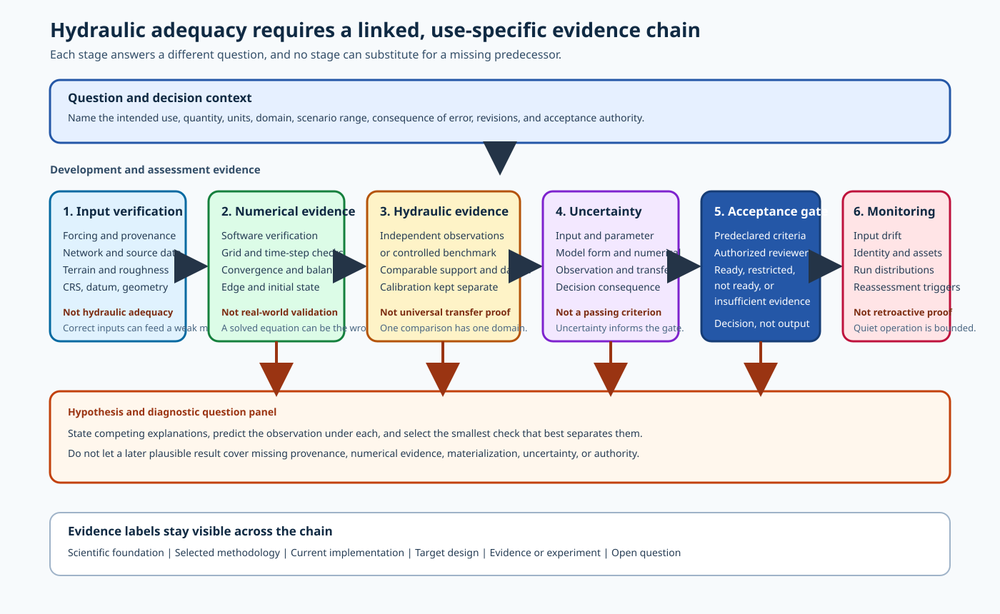

# Validation Framework

Hydraulic adequacy is a use-specific conclusion supported by several distinct kinds of evidence.
No single file, metric, image, or comparison can establish it.

## Why this matters

A completed run can be internally consistent yet answer the wrong scientific question.
A physically plausible map can also come from incomplete provenance, an unintended boundary, unresolved numerical error, or a compensating parameter adjustment.
This framework keeps those evidence types separate so that a reviewer can state what has been established, what remains uncertain, and whether the result is ready for a named decision.

## Prerequisites

Review [Convergence, Mass Balance, and Hot Starts](../03-2d-hydraulics/04-convergence-mass-balance-and-hot-starts.md), [Domain and Boundary Geometry](../04-model-development/04-domain-and-boundary-geometry.md), [KWSE and Stage Transfer](../05-scenario-libraries/03-kwse-and-stage-transfer.md), and [Compositing, Identity, and Provenance](../05-scenario-libraries/05-compositing-identity-and-provenance.md).
Read [Source Authority](../reference/source-authority.md) before using a project case, issue, experiment, or implementation detail as evidence.

## Learning objectives

After this chapter, the reader should be able to:

- distinguish software verification, numerical verification, scientific validation, calibration, benchmark comparison, plausibility review, acceptance criteria, operational monitoring, and post-run diagnosis;
- explain why each evidence lane is necessary but insufficient by itself;
- build a traceable evidence chain for one intended use;
- label project evidence without turning a case or experiment plan into validation proof; and
- issue a direct readiness verdict with explicit gaps and escalation conditions.

## 1. Start with the question and decision context

Validation is not a property that a model possesses for every purpose.
It is an assessment of model agreement with the real world from the perspective of an intended use.
[SCI-043](../reference/bibliography.md#sci-043-nasa-standard-for-models-and-simulations) defines validation and requires acceptance criteria to be tied to the intended use.
[SCI-044](../reference/bibliography.md#sci-044-nist-assessment-of-accuracy-and-reliability) also separates code verification, solution verification, and validation.

Before gathering evidence, record:

1. The decision the result will support.
2. The hydraulic quantity, spatial support, time or scenario range, and units being judged.
3. The consequences of a false acceptance and a false rejection.
4. The model, data, methodology, solver, and artifact revisions in scope.
5. The acceptance authority and the evidence available to that authority.
6. The permitted use and the uses that remain outside the assessment.

A depth raster can be adequate for one screening decision and inadequate for another decision that needs accurate structure head loss, local velocity, or floodplain arrival time.

## 2. Keep the evidence lanes distinct

### 2.1 Software verification

**Scientific foundation:** Software verification asks whether the implemented software satisfies its specified computational behavior.
Examples include unit and integration tests, schema checks, regression tests, conservation test cases, failure-path tests, and comparisons with analytical or manufactured solutions when applicable.

Software verification can establish that code performs a stated calculation correctly.
It cannot establish that the selected equations, input data, parameters, boundaries, or abstractions represent the real river adequately.

### 2.2 Numerical verification

**Scientific foundation:** Numerical verification asks whether the discrete solution adequately represents the selected mathematical model for the stated quantities and tolerance.
It includes spatial and temporal resolution studies, iterative or transient convergence checks, numerical error estimates, conservation diagnostics, and comparisons with known mathematical solutions or higher-resolution results.

Numerical verification is different from the project's volume-convergence termination proxy.
That proxy measures change in total positive-depth storage between two saved grids relative to interval inflow.
It does not estimate grid or time-step error, establish local-state convergence, or close the full mass balance.

### 2.3 Scientific validation

**Scientific foundation:** Scientific validation asks how well the model represents the relevant real-world behavior for the intended use.
Evidence can include independent observations of stage, WSE, discharge, extent, depth, velocity, rating behavior, or another decision-relevant quantity.
The observation uncertainty, representativeness, datum, timing, and spatial support are part of the comparison.

Validation does not prove universal truth.
It establishes bounded evidence over the conditions, locations, quantities, and uses that were assessed.

### 2.4 Calibration

**Scientific foundation:** Calibration adjusts numerical or modeling parameters to improve agreement with a referent.
[SCI-043](../reference/bibliography.md#sci-043-nasa-standard-for-models-and-simulations) and [SCI-045](../reference/bibliography.md#sci-045-epa-environmental-model-guidance) define calibration in this way.

Calibration is not validation because the same data influenced parameter selection.
An evaluation using independent data, or a clearly justified cross-validation design when independent data are scarce, is needed to assess transfer beyond the calibration observations.
Parameter changes must remain physically defensible and must not compensate silently for terrain, datum, forcing, boundary, or structure errors.

### 2.5 Benchmark comparison

**Scientific foundation:** A benchmark comparison evaluates stated model quantities against a defined referent under controlled and comparable conditions.
The referent can be an observation, an analytical result, an accepted test case, or another model whose role and limitations are explicit.

**Selected methodology:** DR-002 ALT-A defines the project benchmark for model-connectivity testing as a composite 2D model developed with the same source inputs, forcing, and hydraulic software.
That selection is scoped to connectivity testing and does not convert the benchmark into real-world validation evidence.

One benchmark comparison can reveal disagreement or support similarity for its tested configuration.
It cannot establish adequacy over other reaches, flows, boundary regimes, data qualities, structures, or intended uses.

### 2.6 Plausibility review

**Scientific foundation:** A plausibility review asks whether patterns are physically coherent and whether obvious contradictions are present.
Examples include checking that water follows represented connectivity, WSE profiles do not contain unexplained steps, inundation does not cross high ground without a pathway, and stage responds in the expected direction to forcing changes.

Plausibility review is useful for triage.
It is not validation because a map can look reasonable while being biased, misregistered, incomplete, numerically unresolved, or produced from the wrong inputs.

### 2.7 Acceptance criteria

**Scientific foundation:** Acceptance criteria are the recorded qualitative or quantitative conditions used by an authorized reviewer to judge fitness for the intended use.
[SCI-043](../reference/bibliography.md#sci-043-nasa-standard-for-models-and-simulations) requires criteria for verification, validation, uncertainty, sensitivity, and assessment thresholds.

Acceptance criteria should identify the quantity, statistic or rule, spatial and temporal support, flow or stage range, datum, uncertainty treatment, threshold, responsible authority, and response to failure.
Criteria must be defined before inspecting the answer whenever practical so that the result does not choose its own passing rule.

**Open question:** The reviewed 2D FIM sources do not yet provide one authorized, project-wide acceptance policy that covers software, numerical, hydraulic, benchmark, uncertainty, materialization, and operational evidence for each product use.
This handbook therefore asks validation questions and does not invent pass thresholds.

### 2.8 Operational monitoring

Operational monitoring observes repeated production behavior after an approach has been accepted for a stated use.
It should detect input drift, source-version changes, identity collisions, missing assets, unusual termination patterns, threshold excursions, distribution shifts, and failures in network or storage dependencies.

Monitoring can show that current operation remains within recorded limits.
It cannot retroactively supply missing verification or validation, and an alert-free interval does not prove scientific adequacy.

### 2.9 Post-run diagnosis

Post-run diagnosis investigates a particular result after execution.
It compares competing explanations, selects the next observation that best distinguishes them, and stops when evidence supports a bounded conclusion or requires escalation.

Diagnosis is not acceptance.
It can identify a likely cause or an evidence gap while the result remains not ready for hydraulic interpretation.
Use the ordered process in [Diagnostic Workflow](02-diagnostic-workflow.md).

## 3. The validation evidence chain

**What to notice:** Input verification, numerical evidence, hydraulic or benchmark evidence, uncertainty, acceptance criteria, and operational monitoring are separate linked stages.
The feedback arrows show that a failed or ambiguous stage returns the reviewer to a stated hypothesis rather than allowing later evidence to cover the gap.
Acceptance is a decision gate, not another model output.
Monitoring follows acceptance and remains bounded by the accepted use.

## 4. Why common shortcuts do not establish adequacy

| Observation | What it can establish | What it cannot establish independently |
| --- | --- | --- |
| Solver exit or returned result | The process ended in a recorded way and may have produced a job response. | Correct inputs, stable numerics, quasi-steady behavior, complete artifacts, or physical adequacy. |
| Artifact presence | Bytes or an object exist at an address. | Correct content, complete publication, intended identity, compatible datum, or hydraulic acceptance. |
| Manifest equality | Stored declared inputs equal a target request under the current comparison. | Presence and integrity of every referenced asset, current scientific intent, or adequacy of the result. |
| Volume-convergence proxy | Net positive-depth storage changed little relative to interval inflow at the compared outputs. | Full inflow-outflow mass balance, local convergence, grid independence, clean edges, or validation. |
| Absence of a warning | No implemented warning was emitted or persisted. | That the relevant check ran, that unimplemented checks passed, or that the warning list is complete. |
| Visual plausibility | The displayed pattern lacks an immediately obvious contradiction to the reviewer. | Quantified bias, independent observation agreement, provenance, numerical accuracy, or uncertainty. |
| One benchmark | Agreement or disagreement for one referent and bounded configuration. | Transfer across untested reaches, regimes, sources, resolutions, boundaries, or intended uses. |

Current project details make these distinctions material.
The current scenario result can return a manifest path without independent storage observation.
Current exact-input reuse does not re-observe every referenced scenario asset.
Current convergence branch ordering can store `volume_convergence` when an edge violation is simultaneously true.
Current warning coverage omits several science-level checks documented in the crosswalk and conflict register.

## 5. Build a reviewable evidence record

A validation record should contain these sections even when some sections conclude that evidence is unavailable:

1. **Question and intended use.**
State the decision, quantities, domain, scenario range, and consequences of error.
2. **Configuration and provenance.**
Record immutable or content-based input identity, transformation history, methodology revision, solver build, settings, hardware when relevant, and artifact addresses.
3. **Software verification.**
Name the specification, tests, reference cases, revisions, and unresolved failures.
4. **Numerical verification.**
Record grid and time-step evidence, local and global convergence, mass-balance terms, edge diagnostics, and numerical error estimates.
5. **Calibration.**
Identify adjusted parameters, defensible bounds, objective, data used, nonuniqueness, and the calibration domain.
6. **Validation or benchmark comparison.**
Identify independent referents, comparability, metrics, uncertainty, results, and domain of applicability.
7. **Plausibility and diagnosis.**
Record reviewed patterns, competing hypotheses, discriminatory checks, and unresolved contradictions.
8. **Uncertainty and sensitivity.**
Describe known sources, their influence on decision-relevant outputs, and unavailable uncertainty information.
9. **Acceptance decision.**
Name the predeclared criteria, authority, result, restrictions, failed criteria, and required follow-up.
10. **Operational monitoring.**
Define drift signals, alert thresholds, evidence retention, ownership, and reassessment triggers.

Each statement should carry an evidence label from [Source Authority](../reference/source-authority.md).
A checked-in case, issue, or experiment retains the label **Evidence or experiment** unless an authorized source gives it another role.

## 6. Project evidence boundaries

### Current implementation

The current jobs checkout defines implemented manifest fields, run behavior, termination logic, publication steps, and warnings.
Code does not define whether the resulting hydraulic product is acceptable for a scientific use.

### Selected methodology

Decision Register alternatives define intended methodology within their recorded status and scope.
A selected method still requires implementation evidence, numerical evidence, validation evidence, and acceptance authority.

### Target design

System-design material defines intended ownership and reconciliation contracts.
It does not prove deployment, successful observation, or scientific acceptance.

### Evidence or experiment

Case-018 records strong agreement for a particular Winooski comparison conducted under the EXP-013 methodology and also records DEM and WSE artifacts.
That bounded result does not validate every reach-based composite or resolve the identified anomalies.
Case-018 records a completed comparison of candidate quasi-steady metrics against modeler judgment under a section linked to EXP-014.
It does not prove that the selected threshold closes mass balance or establishes hydraulic adequacy in every setting.
The standalone EXP-013 and EXP-014 files contain descriptions and methodologies rather than those completed observations.
EXP-012 is an experiment plan for topobathymetry and calibration rather than completed validation proof.
The twelve issue records identify observed failure signatures but generally do not establish their causes.

## 7. Readiness language

Use one of these verdicts for the stated intended use:

- **READY FOR THE STATED USE** means every required evidence category and authorized acceptance criterion passed within the recorded scope.
- **READY WITH RESTRICTIONS** means the authorized criteria permit use within explicit limits and every material limitation is visible to the decision maker.
- **NOT READY** means required evidence is missing, conflicting, outside limits, or fails a criterion.
- **INSUFFICIENT EVIDENCE TO ASSESS** means the packet cannot support either acceptance or a bounded rejection of the model behavior.

Do not use **READY** when storage materialization, numerical verification, validation, uncertainty, or acceptance authority remains merely assumed.

## Common misconceptions

### "Calibration made the model valid"

Calibration improves agreement with the data used to tune parameters.
It does not independently test predictive performance or eliminate compensating errors.

### "The benchmark is the truth"

A benchmark is a referent with its own model form, inputs, numerics, and uncertainty unless it is a direct observation.
Agreement should be reported as comparison evidence under the benchmark's scope.

### "The manifest proves the scenario exists"

A manifest is one artifact and can reference absent, stale, mixed-generation, or incompatible assets.
Materialization requires observed completeness and integrity under the applicable contract.

### "Monitoring replaces validation"

Monitoring detects changes relative to an operating baseline.
It cannot establish that the baseline was scientifically adequate.

## Competency check

1. Give one example of evidence that belongs to each of the nine evidence lanes.
2. Explain why `volume_convergence` can be true while a result remains numerically or hydraulically inadequate.
3. Explain why DR-002's benchmark is useful for connectivity testing but is not automatically field validation.
4. State the minimum information needed to turn a visual comparison into a reviewable benchmark record.
5. Issue a verdict for a scenario with matching manifest inputs, present depth, missing STL, no independent observation, and no acceptance policy.

## Further reading and source notes

- [SCI-043](../reference/bibliography.md#sci-043-nasa-standard-for-models-and-simulations) supplies direct official definitions for verification, validation, calibration, uncertainty characterization, and intended-use acceptance criteria.
- [SCI-044](../reference/bibliography.md#sci-044-nist-assessment-of-accuracy-and-reliability) separates code verification, solution verification, validation, and regions of validity in scientific computing.
- [SCI-045](../reference/bibliography.md#sci-045-epa-environmental-model-guidance) covers environmental-model calibration, corroboration, sensitivity, uncertainty, and decision-specific quality specifications.
- [SDR-004](../reference/bibliography.md#sdr-004-cases-issues-and-experiments) supplies scoped project cases, issues, and experiment plans.
